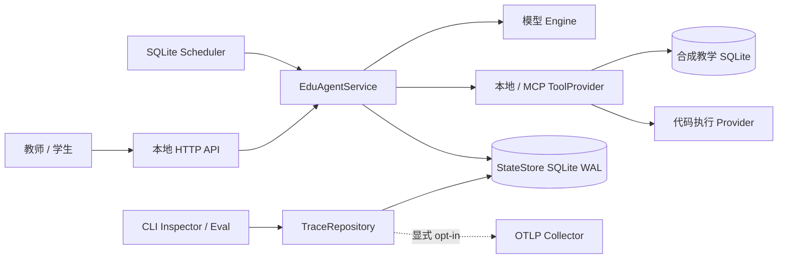
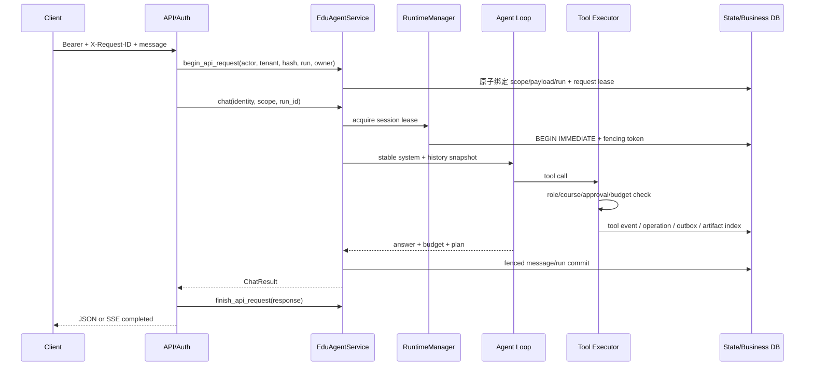
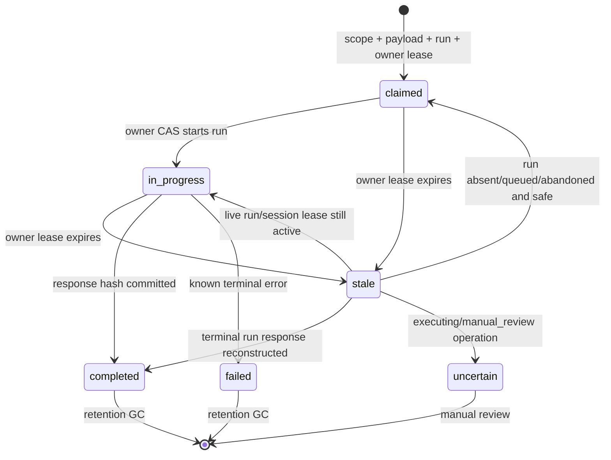
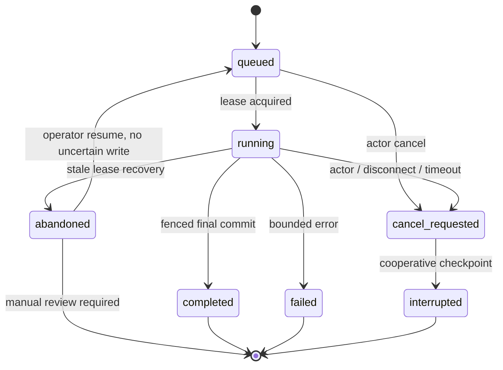
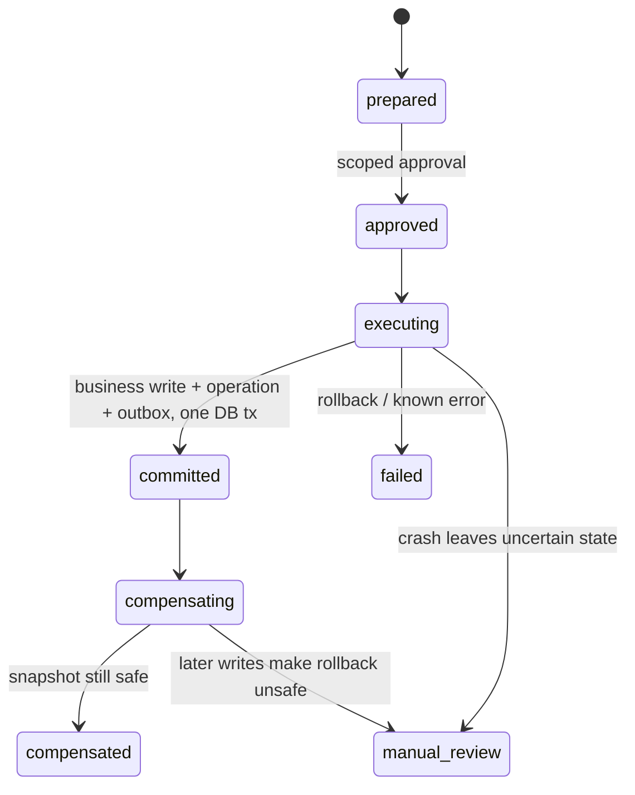
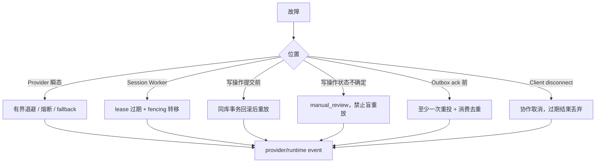

# EduAgent 架构与运行边界

本文描述当前代码可验证的结构，不把路线图或 mock 结果当作已部署能力。源码入口是
`edu_agent/service.py`，运行状态真相是 `StateStore` 与教学业务库；Trace 是只读投影，不是第二套状态。

## C4：系统上下文



外部信任边界：模型输出、MCP 返回、课件文本和待执行代码均不可信；认证身份来自 API adapter，不能
从请求 body 覆盖；Docker socket、OTLP Collector、真实模型端点和真实 LMS 都是部署者负责的外部信任根。

## C4：容器与所有权

| 容器 | 职责 | 持久真相 | 禁止事项 |
|---|---|---|---|
| `EduAgentApi` | auth、request id、HTTP/SSE、错误映射 | `api_requests` | 复制 Agent Loop、信任 body 身份 |
| `EduAgentService` | 组装上下文、运行与恢复、统一能力门面 | `runs/messages` | 绕过执行器直接 dispatch 写工具 |
| `Agent Loop` | 模型/工具交替和 Plan 完成门 | Plan/Evidence、tool event | synthetic user reflect、把模型自述当证据 |
| `PolicyToolExecutor` | 参数、角色、范围、审批、预算复验 | operation/outbox/artifact | 把 Prompt 当安全边界 |
| `RuntimeManager` | session lease、heartbeat、fencing、取消 | `session_leases/runs` | 宣称跨主机共识 |
| `TraceRepository` | owner-scoped keyset 查询与分页导出 | 可重建 `trace_event_index` | 修改业务状态、读取 Artifact 全文 |

## Provider Gateway 与同步兼容面

当前真实模型调用路径是 `Engine.chat -> GatewayEngine -> ProviderGateway -> API-mode adapter ->
OpenAI SDK`。`ProviderSpec` 先解析为不可变 `ResolvedRoute`，Gateway 再按 `ApiMode` 选择
`ChatCompletionsAdapter` 或 `ResponsesAdapter`。每个 adapter 独占自己的 wire 映射和
`EngineResponse/ToolCall` 规范化；Responses adapter 会把 Chat 形态的历史 function call/result 分别转成
`function_call`/`function_call_output` item，并把 token 名称和 completion status 归一到现有 Chat 语义。
通义兼容端点与本地 vLLM 仍走 Chat Completions，`MockEngine`、Agent 图和 eval 继续只依赖同步
`Engine.chat(messages, tools)`。

新代码通过 `edu_agent.engine.get_engine()` 获取 Gateway-backed Engine（配置启用韧性层时外包一层
`ResilientEngine`）。直接构造
`OpenAICompatEngine(base_url, api_key, model, ...)` 的旧调用仍兼容，但该类只是把旧参数翻译成
`ProviderSpec + ChatCompletionsAdapter` 的薄层，不再维护第二套请求逻辑。Gateway 工厂注册
`chat_completions` 与 `responses` 两种 mode；两者当前均为同步调用。Responses mode 的 tool calling 与
usage 已启用，text-format structured output 和 Provider streaming 明确关闭；model-specific context/output
上限为 `None` 时表示未知，不能解释为无限。已声明不支持的 tool/strict schema、非文本输入或已超过明确
context window 的请求会在 SDK 调用前失败。

`ResilientEngine` 在冻结的 `ResolvedRoute.identity` 粒度共享并发 semaphore 与 circuit breaker。连接、超时、
429 和 5xx 使用 full-jitter 有界退避；合法 `Retry-After` 秒数或 HTTP-date 覆盖本地退避并受独立上限约束。
认证、权限、普通 400、context overflow、output cap 和未知错误不重试。half-open 每个 route 只允许一个探测，
route 状态注册表按容量和空闲 TTL 回收；每个实际 Provider attempt 单独写入脱敏审计事件。
默认 SDK client 关闭自身重试，由这一层统一拥有尝试次数、等待和审计；显式注入的 client/factory 由调用方控制。
primary/fallback route plan 在 turn 起点冻结；fallback 只允许连接、超时、可恢复 429、5xx 或已打开 circuit，且
目标 adapter 必须能无网络表示当前请求。tool calling、strict schema、API mode 请求形态和已声明 context window
逐项检查；Provider fallback 的 context window 未知时拒绝，不能按无限处理。Trace 记录候选选择、拒绝/切换原因和
唯一胜出 attempt；返回新的 `EngineResponse` 副本，只结算胜出 route usage。配置仍是每条 route 单一
`CredentialRef`，没有 key pool 或运行时凭据轮换。

## 请求数据流



SSE 只流式传输状态，不伪装 token streaming。连接断开后 API 请求协作取消；若外部模型/工具调用不可中断，
它返回后仍需通过取消和 fencing 检查，结果才可能提交。

`api_requests` 在 actor/tenant 内将 request id 永久绑定 payload hash，并在启动 Agent 前原子绑定预分配
run id、owner lease 与 attempt。首次响应先规范化并脱敏、落库并计算 response hash，再返回；重放读取
同一 status/content-type/headers/body 表示。不同 payload 稳定冲突；过期 owner 无法提交结果。

## 数据分类矩阵

| 分类 | 业务库 | 状态库 | Artifact | 日志 | API | Trace / OTLP |
|---|---|---|---|---|---|---|
| 认证凭据/审批秘密 | 禁止；审批只存 hash/scope/decision | 写前 fail-closed 脱敏 | 写前脱敏 | 脱敏 | 请求头只用于认证、不回显 | 禁止，二次脱敏 |
| 学生 PII | 授权教学表允许 | 只在明确业务语义允许；自由文本不作完整 DLP 承诺 | owner/role 控制 | 默认禁止 | 授权业务接口可返回所需字段 | 默认遮蔽直接标识 |
| owner/scope 标识 | 必要时存 | 原样保存，作为安全键 | 路径/索引隔离键 | 最小化 | Principal 决定 | owner-scoped 查询保留，不可改写 |
| 教学业务原始数据 | 授权表允许 | 只保存运行所需投影 | owner-scoped 可保存 | 最小化 | scope 校验后返回 | 只导出诊断所需 metadata |
| 自由文本 | 授权表允许 | 秘密模式写前脱敏 | 秘密模式写前脱敏 | 脱敏 | 首次/重放同一脱敏表示 | 秘密 + 已知直接 PII 二次脱敏 |
| 运行指标 | 不适用 | 保留数值 | metadata 可保留 | 可保留 | 可返回 | 保留 `input/output/total/max_tokens`、`fencing_token` |

规则来源统一在 `edu_agent/data_classification.py`：持久化层和 export 层允许不同动作，但共享分类。
`scripts/audit_data_boundaries.py` 默认只读扫描 SQLite 主文件/WAL/SHM、JSON/JSONL、日志和 Artifact，
只输出分类、位置、计数，不回显命中值。本项目没有实现自动修复模式。正则只覆盖已知格式，真实数据
部署仍需外部 DLP、数据保留和删除策略。

## API Request 状态机



崩溃窗口：claim 后未启动时复用预分配 run；运行中且 session lease 有效时返回可重试的 in-progress；run
已完成但 response 未提交时从持久消息/run 重建并提交；response 已提交但客户端未收到时直接重放同一
响应。若存在状态不确定的写 operation，则进入 `uncertain`，返回 manual-review 语义而不是盲重放。
`expire_api_request_leases` 和 `gc_api_requests` 都要求 actor/tenant scope、有限 batch 并写审计；GC 只删
过期 completed/failed envelope，不删除 run 或 ToolOperation，也不清理仍需恢复/人工审查的记录。

## Run 状态机



同一 SQLite 文件上的 `BEGIN IMMEDIATE` 负责领取；fencing token 每次 lease 转移递增。消息、Artifact、
Plan/Evidence、tool event 和业务写提交边界都复验 owner/token。它不提供网络分区下的分布式锁、跨区域
一致性或强制终止任意阻塞线程。

## 写操作与恢复



Scheduler/outbox 是至少一次语义；稳定业务键与消费者 `(consumer_name,event_id)` 去重降低重复副作用。
这不是跨系统 exactly-once。补偿只对具备前置快照且未被后续写覆盖的操作自动执行。

## Trace 投影

`RuntimeEvent v1` 包含 event id、schema version、UTC timestamp、稳定 sequence、run/root/parent/session、
actor/tenant、component/type/status、duration、usage、error 和 attributes。来源包括：

```text
runs/messages/session_leases -> runtime/conversation
provider_events              -> provider
plans/plan_steps/evidence    -> planning/evidence
tool_events/operation_refs   -> tool/transaction/sandbox
artifacts                    -> artifact metadata only
delegation_runs              -> subagent tree
scheduled_jobs/audit_events  -> scheduler/security
```

每个源表写事务通过同库 trigger 同步追加 `trace_event_index`；源表仍是业务真相，索引可从源表重建，
不允许反向驱动运行状态。查询先验证 actor/tenant 与 run/session 归属，再以
`timestamp/source_priority/fencing_sequence/event_id` 做 keyset 排序；cursor v1 由 HMAC 保护，绑定
scope/filter、`MAX(index.id)` 快照、最后排序键、total 和过期时间。并发新增事件不会进入旧快照，跨页
不重复/遗漏；非法、过期、篡改和跨 scope cursor 被拒绝。

每页 SQL 只读取 `page_size + 1` 行；首屏额外做 snapshot/total 查询，后续不重投全历史。JSON/JSONL 从
数据库到 socket 逐页编码，内存随 page size 而不是 trace 总量增长。Artifact Trace 只含 metadata；正文
API 仍流式计算完整 SHA-256 且只保留请求范围。`artifacts/trace-scaling.json` 记录当次事件量、page size、
查询数、峰值内存和耗时；它是本机可重复样本，不是长期容量结论。

### RunEvent v2 传输协议

`RunEvent v2` 是运行中传输协议，不替代 `RuntimeEvent v1` Trace。稳定 envelope 为
`schema_version/event_id/event_type/run_id/session_id/attempt/sequence/timestamp/writer_id/fencing_token/payload`；
timestamp 规范化为 UTC，payload 在进入总线前经过中心脱敏并验证为有限 JSON。最小事件族为
`run.phase`、`text.delta`、`tool_call.delta`、`usage`、`plan.updated`、`tool.started`、`tool.completed`、
`context.compacted`、`fallback.activated`、`completed` 和 `error`。`RunPhase` 固定为
`accepted -> planning -> model -> tools -> verifying -> finalizing -> terminal`。

同一 `(run_id, attempt)` 的 sequence 在锁内分配；生产者完成时间和墙钟可以乱序，消费者只以 sequence
判断该 stream 的发布顺序。相同 fencing token 只能由同一 writer 使用；更高 token 可在 terminal 前接管并
延续 sequence，旧 writer 随即被拒绝。`completed/error` 是唯一 terminal event，发布后拒绝包括 delta 在内的
任何后续事件，也拒绝新 writer 接管。attempt/fencing token 为非负整数：`0` 只保留给 attempt 前生命周期事件
或尚未绑定持久 lease 的本地 producer，获得持久 lease 后使用其递增 token。

| 层 | 职责 | 明确不负责 |
|---|---|---|
| `RunEventBus` | 当前进程内 future-only 发布/订阅、sequence、writer fence、有界 fan-out | 落库、历史回放、断线恢复、跨进程传输 |
| `TraceRepository` | 从现有业务/审计表只读投影并导出 `RuntimeEvent v1`；索引可重建 | 消费 EventBus 作为新真相源、保存 token delta |
| `RunJournal`（R2.2） | 后续保存恢复所需 sequence/loop cursor 和提交状态 | 替代 Plan/Evidence/ToolOperation/Artifact/Trace 真相 |

每个订阅 buffer、进程内 stream state 数和活跃订阅总数都有固定上限。达到 stream/subscription 上限时
fail closed；buffer 满时只取消该慢消费者、清空不完整队列并显式返回 `SlowConsumerError`，生产者和其他
订阅者不阻塞。消费者主动取消会唤醒等待线程，但不等同于取消 run。terminal tombstone 不静默淘汰，避免
以内存回收为由重新接受 late delta。总线不缓存订阅前事件，重连方必须在后续阶段依赖持久 cursor/状态，
而不能向 EventBus 请求 replay。

R2.1 只用 fake producer 验证该协议。当前 Provider 仍为同步 `chat()`，HTTP SSE 仍只有
`accepted/keepalive/completed`，assistant/tool 消息提交时机也未改变；真 Provider delta 和 SSE 映射分别留给
R2.5、R2.6。

## 安全边界

| 风险 | 执行层保证 | 剩余边界 |
|---|---|---|
| IDOR/跨租户 | token 映射固定 Principal；run/session/plan/artifact/trace/schedule owner 复验 | Demo token adapter 不是生产登录系统 |
| 密钥/审批秘密 | 共享分类器驱动写前/导出双层脱敏；只读审计覆盖 SQLite/WAL/SHM/JSON/日志/Artifact/API | 正则不能替代部署 DLP/删除策略 |
| 学生敏感字段 | 授权教学业务库保留原始数据；Trace/OTLP 按字段遮蔽，API/Artifact 复验 owner/role | 任意自由文本 PII 仍需部署方 DLP，不能声称持久化层清除全部学生数据 |
| 运行指标 | token 用量、预算和 fencing token 明确保留数值语义 | 敏感键分类必须避免按子串误删指标 |
| Prompt injection | 课件不可信；工具面、参数、scope、审批在执行层复验 | 模型回答质量仍可能受内容影响 |
| 代码执行 | 默认关闭；固定 digest、禁网、无挂载、非 root、只读 rootfs、限额与取消 | Docker socket 是高权限信任根；只声明已跑 E2E 的具体后端 |
| OTLP | 默认不导入、不发送；安装 extra + endpoint + enable 才导出；异常隔离 | Collector 身份认证与网络策略由部署方配置 |

## 故障恢复图



## 验证口径

评测 corpus 在模板定义阶段分为 Train 55 / Dev 12 / Test 6；`scripts/audit_eval_lineage.py` 用两套新临时库
重复生成并检查稳定 id、来源/版本、跨 split 重复、模板族/等价语义重叠、敏感字段和确定性。Test 使用
独立 seed、实体分布和新意图族，不由随机行切分得到。

`scripts/eval_system.py` 为每次运行写入时间、版本/commit、Git dirty 状态、无私有路径的环境摘要、模型、
seed、完整 lineage manifest hash 和绑定 lock/workload 的 config hash，并独立报告 `api_recovery` 与
`trace_scaling`。commit 只从真实 Git 元数据读取；candidate/release 模式拒绝 commit 或 Git 状态不可用以及
dirty worktree。离线 oracle 只证明 Test harness 与契约，真实模型另列且当前为 `not_run`；没有当次真实
Docker/Jobe 报告时 sandbox 项为 `not_verified`。完整一键门禁见
`zsh scripts/accept_stage8.sh`。该入口自动按 `.python-version` 和 `uv.lock` 准备环境，清空真实 Provider
凭据，把合成库及中间状态限制在有界清理的私有临时目录，并在 artifact 生成后再次执行敏感数据审计；
`--dry-run` 只验证调用图，不构成后端通过证据。
