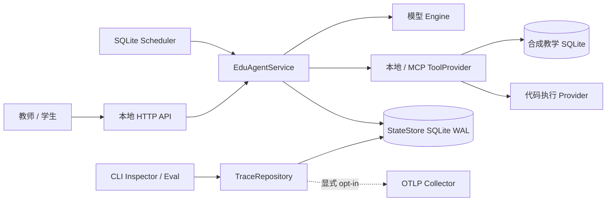
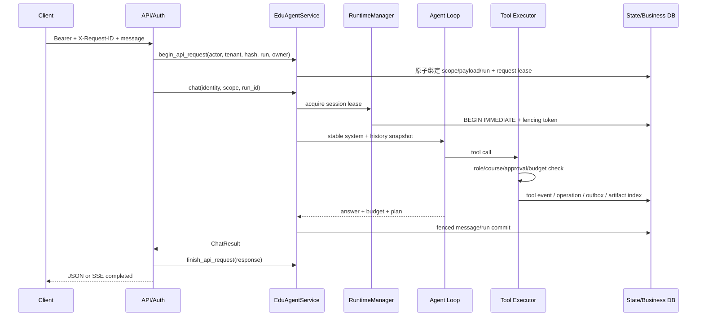
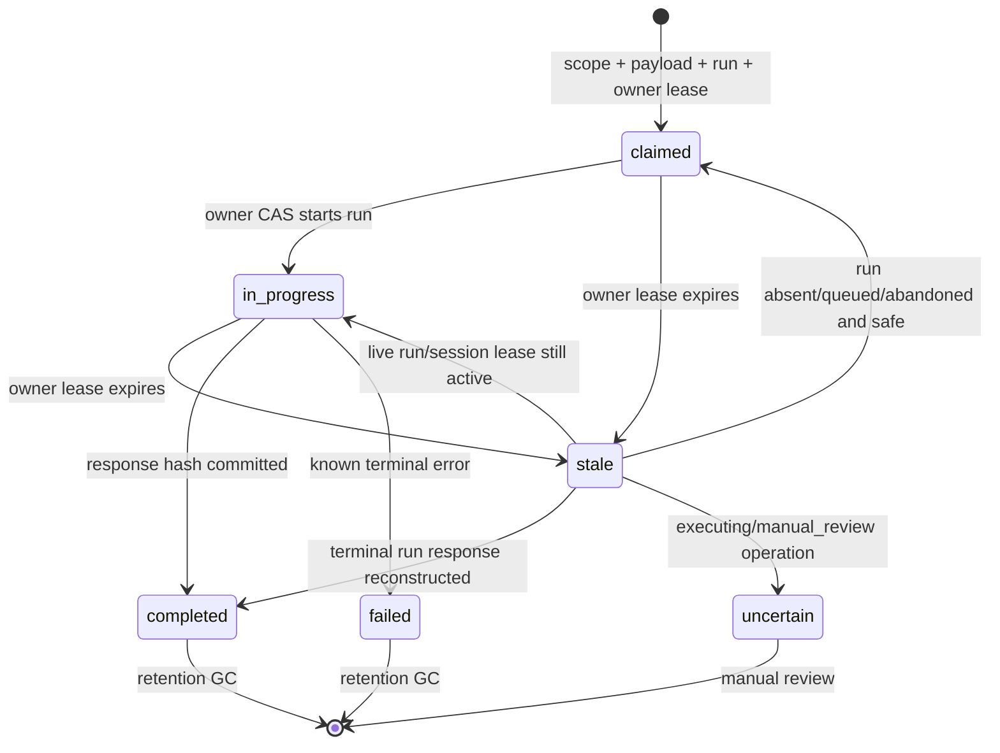
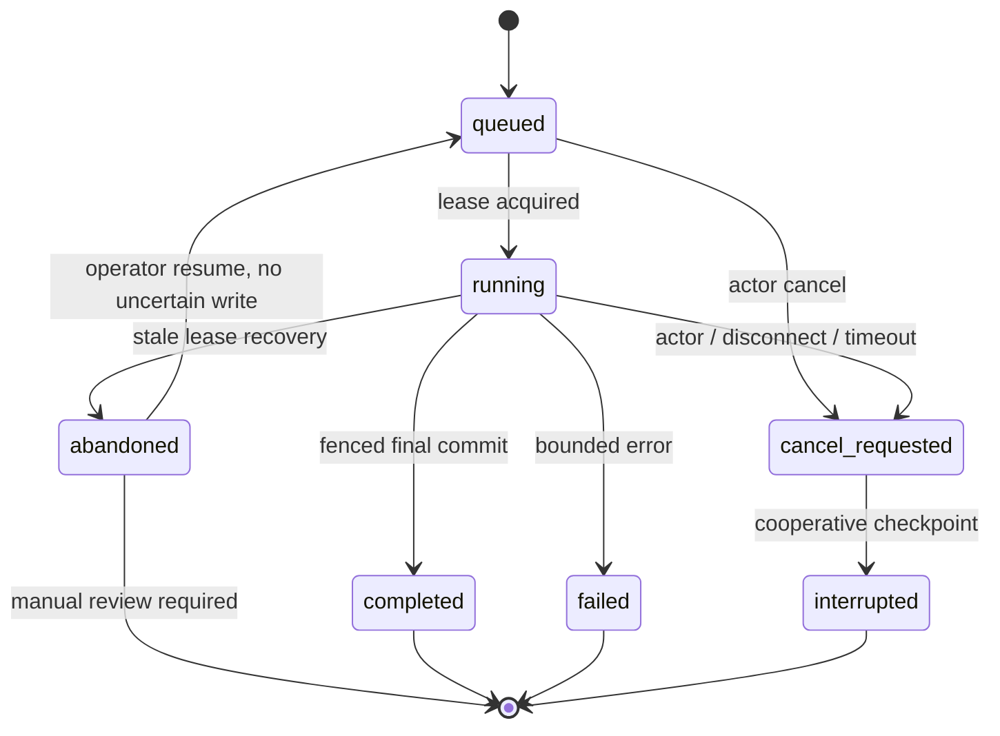
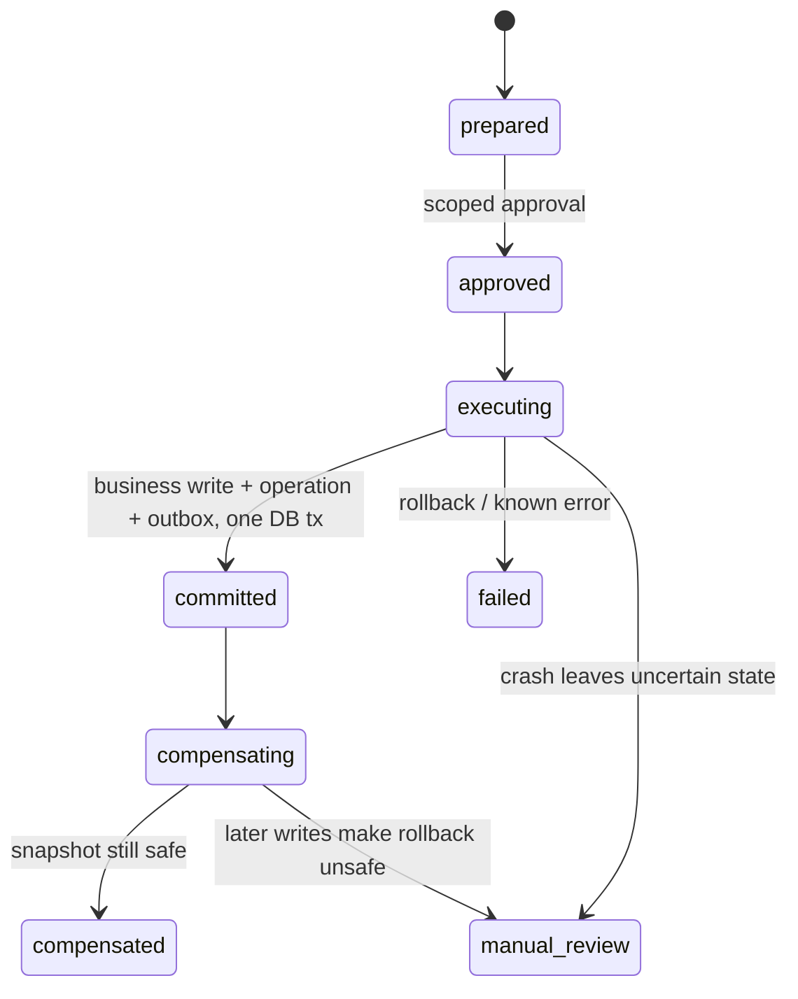
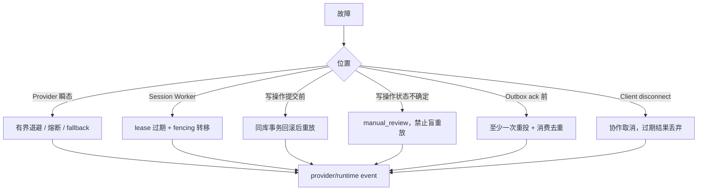

# EduAgent 架构与运行边界

本文描述当前代码可验证的结构，不把路线图或 mock 结果当作已部署能力。源码入口是
`edu_agent/service.py`，运行状态真相是 `StateStore` 与教学业务库；Trace 是只读投影，不是第二套状态。

## C4：系统上下文



外部信任边界：模型输出、MCP 返回、课件文本和待执行代码均不可信；认证身份来自 API adapter，不能
从请求 body 覆盖；Docker socket、OTLP Collector、真实模型端点和真实 LMS 都是部署者负责的外部信任根。

## C4：容器与所有权

| 容器 | 职责 | 持久真相 | 禁止事项 |
|---|---|---|---|
| `EduAgentApi` | auth、request id、HTTP/SSE、错误映射 | `api_requests` | 复制 Agent Loop、信任 body 身份 |
| `EduAgentService` | 组装上下文、运行与恢复、统一能力门面 | `runs/messages` | 绕过执行器直接 dispatch 写工具 |
| `Agent Loop` | 模型/工具交替和 Plan 完成门 | Plan/Evidence、tool event | synthetic user reflect、把模型自述当证据 |
| `PolicyToolExecutor` | 参数、角色、范围、审批、预算复验 | operation/outbox/artifact | 把 Prompt 当安全边界 |
| `RuntimeManager` | session lease、heartbeat、fencing、取消 | `session_leases/runs` | 宣称跨主机共识 |
| `TraceRepository` | owner-scoped keyset 查询与分页导出 | 可重建 `trace_event_index` | 修改业务状态、读取 Artifact 全文 |

## 请求数据流



SSE 只流式传输状态，不伪装 token streaming。连接断开后 API 请求协作取消；若外部模型/工具调用不可中断，
它返回后仍需通过取消和 fencing 检查，结果才可能提交。

`api_requests` 在 actor/tenant 内将 request id 永久绑定 payload hash，并在启动 Agent 前原子绑定预分配
run id、owner lease 与 attempt。首次响应先规范化并脱敏、落库并计算 response hash，再返回；重放读取
同一 status/content-type/headers/body 表示。不同 payload 稳定冲突；过期 owner 无法提交结果。

## 数据分类矩阵

| 分类 | 业务库 | 状态库 | Artifact | 日志 | API | Trace / OTLP |
|---|---|---|---|---|---|---|
| 认证凭据/审批秘密 | 禁止；审批只存 hash/scope/decision | 写前 fail-closed 脱敏 | 写前脱敏 | 脱敏 | 请求头只用于认证、不回显 | 禁止，二次脱敏 |
| 学生 PII | 授权教学表允许 | 只在明确业务语义允许；自由文本不作完整 DLP 承诺 | owner/role 控制 | 默认禁止 | 授权业务接口可返回所需字段 | 默认遮蔽直接标识 |
| owner/scope 标识 | 必要时存 | 原样保存，作为安全键 | 路径/索引隔离键 | 最小化 | Principal 决定 | owner-scoped 查询保留，不可改写 |
| 教学业务原始数据 | 授权表允许 | 只保存运行所需投影 | owner-scoped 可保存 | 最小化 | scope 校验后返回 | 只导出诊断所需 metadata |
| 自由文本 | 授权表允许 | 秘密模式写前脱敏 | 秘密模式写前脱敏 | 脱敏 | 首次/重放同一脱敏表示 | 秘密 + 已知直接 PII 二次脱敏 |
| 运行指标 | 不适用 | 保留数值 | metadata 可保留 | 可保留 | 可返回 | 保留 `input/output/total/max_tokens`、`fencing_token` |

规则来源统一在 `edu_agent/data_classification.py`：持久化层和 export 层允许不同动作，但共享分类。
`scripts/audit_data_boundaries.py` 默认只读扫描 SQLite 主文件/WAL/SHM、JSON/JSONL、日志和 Artifact，
只输出分类、位置、计数，不回显命中值。本项目没有实现自动修复模式。正则只覆盖已知格式，真实数据
部署仍需外部 DLP、数据保留和删除策略。

## API Request 状态机



崩溃窗口：claim 后未启动时复用预分配 run；运行中且 session lease 有效时返回可重试的 in-progress；run
已完成但 response 未提交时从持久消息/run 重建并提交；response 已提交但客户端未收到时直接重放同一
响应。若存在状态不确定的写 operation，则进入 `uncertain`，返回 manual-review 语义而不是盲重放。
`expire_api_request_leases` 和 `gc_api_requests` 都要求 actor/tenant scope、有限 batch 并写审计；GC 只删
过期 completed/failed envelope，不删除 run 或 ToolOperation，也不清理仍需恢复/人工审查的记录。

## Run 状态机



同一 SQLite 文件上的 `BEGIN IMMEDIATE` 负责领取；fencing token 每次 lease 转移递增。消息、Artifact、
Plan/Evidence、tool event 和业务写提交边界都复验 owner/token。它不提供网络分区下的分布式锁、跨区域
一致性或强制终止任意阻塞线程。

## 写操作与恢复



Scheduler/outbox 是至少一次语义；稳定业务键与消费者 `(consumer_name,event_id)` 去重降低重复副作用。
这不是跨系统 exactly-once。补偿只对具备前置快照且未被后续写覆盖的操作自动执行。

## Trace 投影

`RuntimeEvent v1` 包含 event id、schema version、UTC timestamp、稳定 sequence、run/root/parent/session、
actor/tenant、component/type/status、duration、usage、error 和 attributes。来源包括：

```text
runs/messages/session_leases -> runtime/conversation
provider_events              -> provider
plans/plan_steps/evidence    -> planning/evidence
tool_events/operation_refs   -> tool/transaction/sandbox
artifacts                    -> artifact metadata only
delegation_runs              -> subagent tree
scheduled_jobs/audit_events  -> scheduler/security
```

每个源表写事务通过同库 trigger 同步追加 `trace_event_index`；源表仍是业务真相，索引可从源表重建，
不允许反向驱动运行状态。查询先验证 actor/tenant 与 run/session 归属，再以
`timestamp/source_priority/fencing_sequence/event_id` 做 keyset 排序；cursor v1 由 HMAC 保护，绑定
scope/filter、`MAX(index.id)` 快照、最后排序键、total 和过期时间。并发新增事件不会进入旧快照，跨页
不重复/遗漏；非法、过期、篡改和跨 scope cursor 被拒绝。

每页 SQL 只读取 `page_size + 1` 行；首屏额外做 snapshot/total 查询，后续不重投全历史。JSON/JSONL 从
数据库到 socket 逐页编码，内存随 page size 而不是 trace 总量增长。Artifact Trace 只含 metadata；正文
API 仍流式计算完整 SHA-256 且只保留请求范围。`artifacts/trace-scaling.json` 记录当次事件量、page size、
查询数、峰值内存和耗时；它是本机可重复样本，不是长期容量结论。

## 安全边界

| 风险 | 执行层保证 | 剩余边界 |
|---|---|---|
| IDOR/跨租户 | token 映射固定 Principal；run/session/plan/artifact/trace/schedule owner 复验 | Demo token adapter 不是生产登录系统 |
| 密钥/审批秘密 | 共享分类器驱动写前/导出双层脱敏；只读审计覆盖 SQLite/WAL/SHM/JSON/日志/Artifact/API | 正则不能替代部署 DLP/删除策略 |
| 学生敏感字段 | 授权教学业务库保留原始数据；Trace/OTLP 按字段遮蔽，API/Artifact 复验 owner/role | 任意自由文本 PII 仍需部署方 DLP，不能声称持久化层清除全部学生数据 |
| 运行指标 | token 用量、预算和 fencing token 明确保留数值语义 | 敏感键分类必须避免按子串误删指标 |
| Prompt injection | 课件不可信；工具面、参数、scope、审批在执行层复验 | 模型回答质量仍可能受内容影响 |
| 代码执行 | 默认关闭；固定 digest、禁网、无挂载、非 root、只读 rootfs、限额与取消 | Docker socket 是高权限信任根；只声明已跑 E2E 的具体后端 |
| OTLP | 默认不导入、不发送；安装 extra + endpoint + enable 才导出；异常隔离 | Collector 身份认证与网络策略由部署方配置 |

## 故障恢复图



## 验证口径

`scripts/eval_system.py` 为每次运行写入时间、版本/commit、环境、模型、seed 和 config hash，并独立报告
`api_recovery` 与 `trace_scaling`。离线 oracle 只证明 harness 与契约，真实模型另列；没有真实
Docker/Jobe 报告时 sandbox 项为 `not_verified`。完整一键门禁见
`zsh scripts/accept_stage8.sh`。
