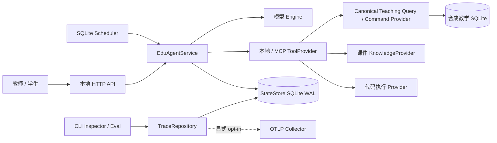
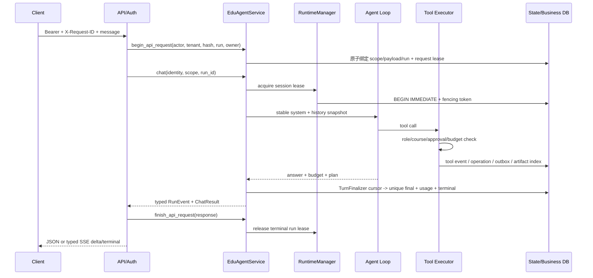
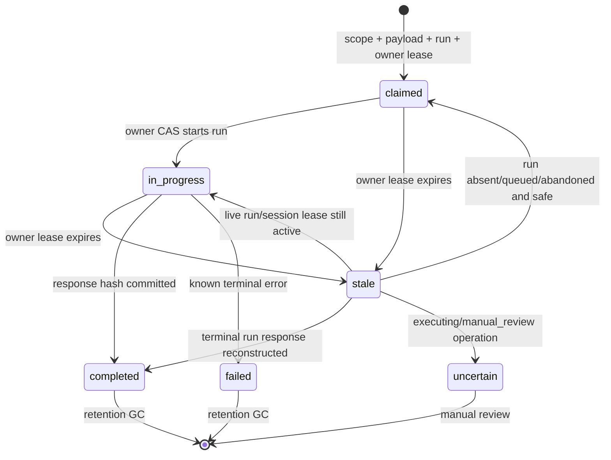
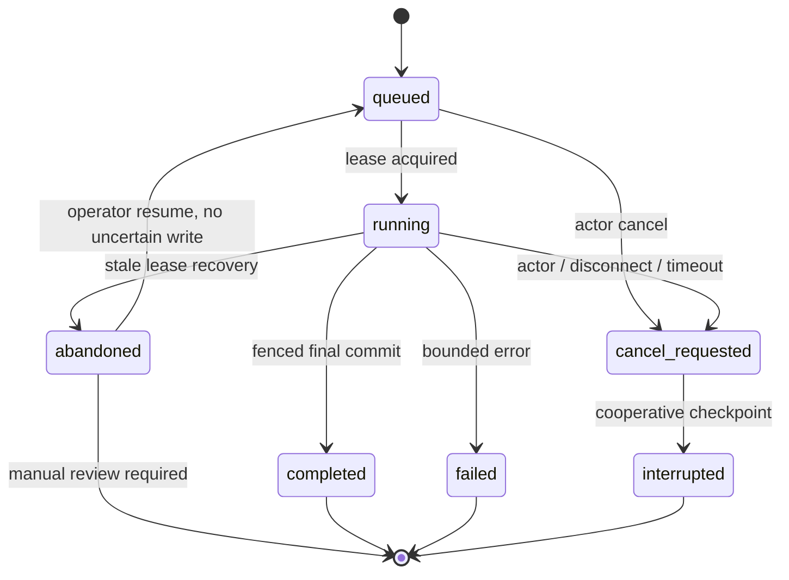
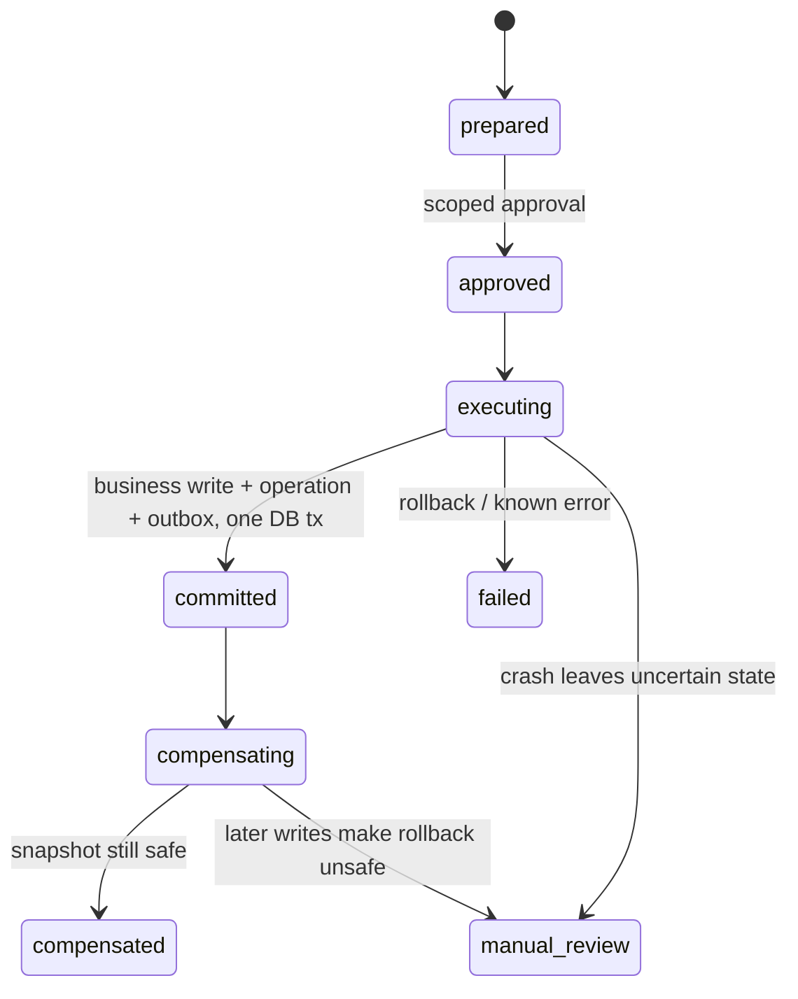
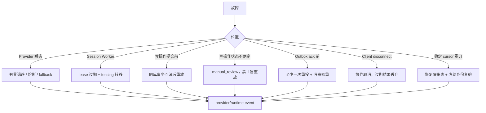

# EduAgent 架构与运行边界

本文描述当前代码可验证的结构，不把路线图或 mock 结果当作已部署能力。源码入口是
`edu_agent/service.py`，运行状态真相是 `StateStore` 与教学业务库；Trace 是只读投影，不是第二套状态。

## C4：系统上下文



外部信任边界：模型输出、MCP 返回、课件文本和待执行代码均不可信；认证身份来自 API adapter，不能
从请求 body 覆盖；Docker socket、OTLP Collector、真实模型端点和真实 LMS 都是部署者负责的外部信任根。

## C4：容器与所有权

| 容器 | 职责 | 持久真相 | 禁止事项 |
|---|---|---|---|
| `EduAgentApi` | auth、request id、HTTP/SSE、错误映射 | `api_requests` | 复制 Agent Loop、信任 body 身份 |
| `EduAgentService` | 组装上下文、运行与恢复、统一能力门面 | `runs/messages` | 绕过执行器直接 dispatch 写工具 |
| `Agent Loop` | 模型/工具交替和 Plan 完成门 | Plan/Evidence、tool event | synthetic user reflect、把模型自述当证据 |
| `PolicyToolExecutor` | 参数、角色、范围、审批、预算复验 | operation/outbox/artifact | 把 Prompt 当安全边界 |
| `TeachingDataProvider` | 规范化 10 个 query、5 个 command、receipt/error 和课程范围 | 合成教学库；写入加入 executor 的同库事务 | 自行审批/commit、暴露表名/ORM、代码执行 |
| `CodeExecutionProvider` | 隔离执行请求/结果、健康与安全 capability | Jobe / Docker adapter | 教学数据读写、ToolOperation |
| `RuntimeManager` | session lease、heartbeat、fencing、取消 | `session_leases/runs` | 宣称跨主机共识 |
| `TraceRepository` | owner-scoped keyset 查询与分页导出 | 可重建 `trace_event_index` | 修改业务状态、读取 Artifact 全文 |

## Provider Gateway 与同步兼容面

当前真实模型调用路径是 `GatewayEngine -> ProviderGateway -> API-mode adapter -> OpenAI SDK stream`。
`ProviderSpec` 先解析为不可变 `ResolvedRoute`，Gateway 再按 `ApiMode` 选择 `ChatCompletionsAdapter` 或
`ResponsesAdapter`。两者将真实 wire/SDK 事件归一为内部 `ProviderStreamEvent`：text delta、按 index 交错的
tool call id/name/arguments delta、usage、completed、error 和可审计 ignored。每个事件绑定冻结 route、全局
attempt 和 provider event id；只有 completed 后聚合器才物化 `ToolCall`，因此半段 arguments JSON 不会进入
Agent 的 JSON/Schema 校验或工具执行。同步 `Engine.chat(messages, tools)` 聚合同一事件迭代器为原有
`EngineResponse`，`MockEngine`、Agent 图和 eval 无需同时迁移，也没有第二套同步核心解析。

Responses adapter 会把 Chat 形态的历史 function call/result 分别转成 `function_call`/
`function_call_output` item，并把 token 名称和 completion status 归一到现有 Chat 语义。通义兼容端点与本地
vLLM 仍走 Chat Completions；Chat 请求使用 `stream_options.include_usage` 等待仅终块 usage，Responses 按
`output_index + item_id` 关联交错 calls。未知事件按配置可审计忽略或 fail closed。

新代码通过 `edu_agent.engine.get_engine()` 获取 Gateway-backed Engine（配置启用韧性层时外包一层
`ResilientEngine`）。直接构造
`OpenAICompatEngine(base_url, api_key, model, ...)` 的旧调用仍兼容，但该类只是把旧参数翻译成
`ProviderSpec + ChatCompletionsAdapter` 的薄层，不再维护第二套请求逻辑。Gateway 工厂注册
`chat_completions` 与 `responses` 两种 mode；已知 OpenAI、通义兼容、vLLM 和显式 custom route 均可声明
streaming。Responses mode 的 tool calling 与 usage 已启用，text-format structured output 仍关闭；
model-specific context/output 上限为 `None` 时表示未知，不能解释为无限。已声明不支持的 tool/strict schema、
非文本输入或已超过明确 context window 的请求会在 SDK 调用前失败。

`ResilientEngine` 在冻结的 `ResolvedRoute.identity` 粒度共享并发 semaphore 与 circuit breaker。连接、超时、
429 和 5xx 使用 full-jitter 有界退避；合法 `Retry-After` 秒数或 HTTP-date 覆盖本地退避并受独立上限约束。
认证、权限、普通 400、context overflow、output cap 和未知错误不在该韧性层重试或 fallback。Provider 明确报告的
input context overflow 只有在 Service 的 checkpoint recovery 边界才可能恢复一次；half-open 每个 route 只允许一个探测，
route 状态注册表按容量和空闲 TTL 回收；每个实际 Provider attempt 单独写入脱敏审计事件。
默认 SDK client 关闭自身重试，由这一层统一拥有尝试次数、等待和审计；显式注入的 client/factory 由调用方控制。
primary/fallback route plan 在 turn 起点冻结；fallback 只允许连接、超时、可恢复 429、5xx 或已打开 circuit，且
目标 adapter 必须能无网络表示当前请求。tool calling、strict schema、API mode 请求形态和已声明 context window
逐项检查；Provider fallback 的 context window 未知时拒绝，不能按无限处理。Trace 记录候选选择、拒绝/切换原因和
唯一胜出 attempt；返回新的 `EngineResponse` 副本，只结算胜出 route usage。配置仍是每条 route 单一
`CredentialRef`，没有 key pool 或运行时凭据轮换。

流式重试复用同一 breaker、semaphore、Retry-After、fallback capability 和审计策略。只有首个 text/tool delta
前的瞬态失败能继续 retry/fallback；一旦已有可见 delta，error 即为该流终态，不会无提示拼接另一 attempt。
旧 attempt 或旧 route 迟到的事件转成可审计 ignored，不进入聚合结果。R2.6 将胜出流映射为 HTTP SSE，
Provider/Agent 失败统一结束为 typed error，terminal 后 writer 拒绝所有 delta。

R4.3 的 `CheckpointContextEngine` 使用 trigger/release 双阈值、最小回收量和按新 user turn 计数的冷却窗口。
压缩先外置大结果，再只归档已完成的旧 exchange；策略 marker 保存本次观察到的最大消息 sequence，进程重开
不会把仍活跃的 recent 消息当作新 turn。摘要将 scope、用户约束、实体、approval、未完成 Plan 和所有引用作为
结构化必保字段，多代 checkpoint 解析并合并这些字段，只截断可选自由文本；字段本身放不下时拒绝压缩。没有可归档
exchange 但 Artifact 替换已回收空间时返回 `artifact_only`；其 Artifact metadata/source sequence 与 owner/run scope
共同形成可复验的崩溃恢复边界，不创建空 checkpoint。

Provider 明确返回 input context overflow 且尚无可见 stream delta 时，`EduAgentService` 最多执行一次重新计数、
强制 checkpoint/Artifact-only 压缩、重建快照并在同一冻结 route 上重试。checkpoint 或 Artifact replacement commit
和 journal reference 是持久恢复边界，started-only 崩溃窗仍可继续，committed 后重启不得重复压缩。第二次
overflow、output cap、普通 invalid request、本地 `CurrentUserInputTooLarge` 和可见流错误均直接分类失败，不进入循环，
也不伪装为 fallback。

## 持久全树预算

R4.4 的 `RunBudgetLedger` 以 `(root_run_id, session_id, actor_id, tenant_id)` 作为不可变 root identity；
`root_run_id` 是表主键，其余三项用于防止恢复或 child 跨 scope 绑定。一个父 run、planner、压缩、所有
retry/fallback attempt、并发工具以及全部 descendant 共用这一行总账。Hermes 风格的 child 独立新预算没有被
用来冒充共享预算；child 的 `IterationBudget` 仍保留更严格的本地上限，但其可用额度必须先从 root reservation
转移。

| 维度 | 持久单位 | 计数边界 |
|---|---:|---|
| `model_calls` | Provider attempt 次数 | 父/child Agent、模型 planner、任何模型摘要，以及每个 retry/fallback 的真实 I/O attempt 各计一次 |
| `tool_calls` | executor 接纳的调用次数 | 串行或并发 segment 中每个取得预算的调用各计一次；batch 规划本身不计 |
| `input_tokens` / `output_tokens` / `total_tokens` | Provider token | 每个实际 attempt 分别累计；`total_tokens` 是独立限制，不由另外两个限制替代 |
| `cost_microusd` | 整数 micro-USD | 仅按冻结的显式价格表计算；对外同时给出 USD 投影 |
| `wall_time_ms` | root elapsed 毫秒 | 从 ledger 创建到 finalizer 的 root 墙钟，覆盖等待、退避、planner、压缩、工具和 child |

纯路由选择、context recount、参数/Manifest 规划校验、journal/Trace 写入和 finalizer bookkeeping 不增加
model/tool/token/cost；它们仍自然消耗 root wall time。当前 checkpoint 压缩是确定性的，因此写入一个稳定的
零额度 operation；若以后使用模型摘要，该 Provider attempt 必须走同一 ledger。HTTP response 的 usage 只描述
胜出的 Provider 结果以保持 API 兼容，但 ledger 会结算失败 retry 和最终 fallback 在内的每个实际 attempt。

`reserve/commit/release` 都在 SQLite `BEGIN IMMEDIATE` 内更新 ledger 与 operation：reserve 按 used + reserved
检查所有维度，防止并发超卖；commit 用实际值替换预留并释放差额，即使 Provider 或 child 实际值超过预留也先
完整落账，再持久化固定的 `budget_exhausted:<dimension>`；失败、取消、超时、拒绝和 lease expiry 会 release
未用 child 额度。每个动作绑定稳定 operation/attempt id 与请求指纹，等价重放返回原结果，不同请求复用同一 id
会失败。恢复通过 `RunBudgetLedger.open()` 读取原 identity、limits、used、reserved、stop reason、价格版本和具体
价目，不会重新发放额度。

Provider usage 缺失时复用 R4.1 的 request breakdown 估算 input/output，并标记 `usage_source=estimated`；只有
Provider total 时保留该实际 total，缺失分量仍估算；流式 attempt 在 error 前已发出的 usage 仍按 actual 结算。
价格配置必须显式且版本化，并在 root 创建时连同规范化价目冻结；未知 route/model 的 cost 保持
`cost_status=unknown`、`cost_usd=null`，已知部分另存为
`known_cost_usd`，不能写 0 冒充免费。预算 Trace 只含 operation id、维度聚合、usage source、cost status 和
安全元数据，不保存 prompt、messages 或 tool arguments。唯一 `budget-finalizer:<root_run_id>` 原子释放残留预留并
冻结墙钟；重复 finalizer 幂等，另一个 finalizer identity 被拒绝。

## 教学 Provider 防腐层

R3.2-R3.3 的 `edu_agent.teaching` 是教学领域数据边界，不是上节 R1 的模型 `ProviderGateway`。三类现有
Provider 的职责不能互换：

| 边界 | 输入/输出 | 当前实现 | 不负责 |
|---|---|---|---|
| 模型 `ProviderGateway` | messages/tools -> 模型 stream/usage | Chat Completions / Responses adapter | 成绩、考试或课程数据 |
| `TeachingDataProvider` | `TeachingQuery/Command` -> `TeachingResult/Receipt` / 稳定错误 | registry-backed `SyntheticProvider` | 模型路由、代码执行、真实平台连接 |
| 课件 `KnowledgeProvider` | tenant/course 检索 -> chunk/citation | SQLite FTS5 + 可选语义检索 | 教务关系查询、模型路由 |

当前 canonical teaching contract 覆盖 10 个查询/分析/图谱切片，以及 `create_exam`、`generate_paper`、`batch_grade`、`assign_homework`、`generate_questions` 5 个 command。`TeachingQueryKind/TeachingCommandKind` 固定业务动作，
`TeachingScope` 携带 actor/tenant/role/course 边界，`TeachingProviderErrorKind` 将失败归一为
`invalid_query/invalid_command/not_found/business_rejected/scope_denied/approval_required/unsupported/unavailable/internal`。`TeachingResult/TeachingReceipt` 在构造时复制并校验 JSON
基础类型，因此不会把 `sqlite3.Row`、表结构或未来生产 ORM 对象送到工具层。

`query_tools`、`analysis_tools` 和 `kg_tools` 只做 schema/context -> canonical query -> 原工具 JSON 映射；
Agent 图、Plan/Evidence、ToolManifest 和 MCP 仍只看到原工具契约。registry 的普通只读 dispatch 不再预开
业务连接；`SyntheticProvider` 每次调用通过 connection factory 获取并关闭一个连接，MCP worker 因而不会
跨线程共享 `sqlite3.Connection`。只有调用方已经拥有受控事务边界时才能显式传入连接，Provider 不关闭它。

`generate_questions` 的实际 effect 在 schema 校验后按 `save_to_bank` 派生：纯生成为 pure，保存题库为 write。写 command 只能由 `PolicyToolExecutor` 签发 operation；`SyntheticProvider` 在同一连接内复验 executing 状态、payload hash、idempotency key、scope 和未过期审批，不 commit。业务变更、committed receipt 和 outbox 仍由原 `TransactionalToolRuntime` 原子提交，原补偿/manual_review 状态机不变。

`run_code` 始终是独立 `CodeExecutionProvider` capability，registry 不再为它打开教学库连接。16 个内置工具最终都由 executor 将 ToolProvider payload 归一为 `ToolResult`；契约 fake 替换后 Agent 图不变，fake 写入仍不能跳过 executor。

### 未来 TeachingPlatform capability 映射

| capability | canonical 动作 | 未来平台适配必须提供 |
|---|---|---|
| `teaching.query` | 成绩/考试/名单/题库/进度 + `generate_paper` | 分页、稳定排序、状态映射、实体级 scope |
| `teaching.analysis` | 错题/薄弱点/成绩分布 | 可复现聚合口径与业务拒绝映射 |
| `teaching.knowledge` | 图查询/学习路径 | 课程图 scope、节点 uid、确定性路径排序 |
| `teaching.write` | 建考试/批量判分/布置作业 | 业务 API 的 request/idempotency key、固定 receipt、scope 和补偿能力声明 |
| `teaching.content` | 纯出题/保存题库 | 按实际 effect 分流，保存分支的业务幂等键 |

本阶段没有 `TeachingPlatformProvider`、生产配置、私有 DDL 或真实数据 fixture。课件 RAG 仍使用独立 tenant/course ACL 和 citation 解析。

## 请求数据流



HTTP SSE 由 handler 单线程写 socket，Provider、Agent、工具和 Plan 的并发事件只进入有界 RunEvent 队列。
每帧 `id` 使用单调 sequence；keepalive 只用于空闲连接保活，不代表 streaming 能力。连接断开、显式 cancel
与 deadline 取消同一个 run token；若外部模型/工具调用不可强杀，它返回后仍需通过取消和 fencing 检查，
迟到结果不会提交。

`api_requests` 在 actor/tenant 内将 request id 永久绑定 payload hash，并在启动 Agent 前原子绑定预分配
run id、owner lease 与 attempt。首次响应先规范化并脱敏、落库并计算 response hash，再返回；重放读取
同一 status/content-type/headers/body 表示。不同 payload 稳定冲突；过期 owner 无法提交结果。

## 数据分类矩阵

| 分类 | 业务库 | 状态库 | Artifact | 日志 | API | Trace / OTLP |
|---|---|---|---|---|---|---|
| 认证凭据/审批秘密 | 禁止；审批只存 hash/scope/decision | 写前 fail-closed 脱敏 | 写前脱敏 | 脱敏 | 请求头只用于认证、不回显 | 禁止，二次脱敏 |
| 学生 PII | 授权教学表允许 | 只在明确业务语义允许；自由文本不作完整 DLP 承诺 | owner/role 控制 | 默认禁止 | 授权业务接口可返回所需字段 | 默认遮蔽直接标识 |
| owner/scope 标识 | 必要时存 | 原样保存，作为安全键 | 路径/索引隔离键 | 最小化 | Principal 决定 | owner-scoped 查询保留，不可改写 |
| 教学业务原始数据 | 授权表允许 | 只保存运行所需投影 | owner-scoped 可保存 | 最小化 | scope 校验后返回 | 只导出诊断所需 metadata |
| 自由文本 | 授权表允许 | 秘密模式写前脱敏 | 秘密模式写前脱敏 | 脱敏 | 首次/重放同一脱敏表示 | 秘密 + 已知直接 PII 二次脱敏 |
| 运行指标 | 不适用 | 保留数值 | metadata 可保留 | 可保留 | 可返回 | 保留 `input/output/total/max_tokens`、`fencing_token` |

规则来源统一在 `edu_agent/data_classification.py`：持久化层和 export 层允许不同动作，但共享分类。
`scripts/audit_data_boundaries.py` 默认只读扫描 SQLite 主文件/WAL/SHM、JSON/JSONL、日志和 Artifact，
只输出分类、位置、计数，不回显命中值。本项目没有实现自动修复模式。正则只覆盖已知格式，真实数据
部署仍需外部 DLP、数据保留和删除策略。

## API Request 状态机



崩溃窗口：claim 后未启动时复用预分配 run；运行中且 session lease 有效时返回可重试的 in-progress；finalizer
未到 terminal 时从持久 cursor 续跑且不完成 API request；run 已完成但 response 未提交时从 finalizer 重建并提交；response 已提交但客户端未收到时直接重放同一
响应。若存在状态不确定的写 operation，则进入 `uncertain`，返回 manual-review 语义而不是盲重放。
`expire_api_request_leases` 和 `gc_api_requests` 都要求 actor/tenant scope、有限 batch 并写审计；GC 只删
过期 completed/failed envelope，不删除 run 或 ToolOperation，也不清理仍需恢复/人工审查的记录。

## Run 状态机



同一 SQLite 文件上的 `BEGIN IMMEDIATE` 负责领取；fencing token 每次 lease 转移递增。消息、Artifact、
Plan/Evidence、tool event 和业务写提交边界都复验 owner/token。它不提供网络分区下的分布式锁、跨区域
一致性或强制终止任意阻塞线程。

## 写操作与恢复



Scheduler/outbox 是至少一次语义；稳定业务键与消费者 `(consumer_name,event_id)` 去重降低重复副作用。
这不是跨系统 exactly-once。补偿只对具备前置快照且未被后续写覆盖的操作自动执行。

## Trace 投影

`RuntimeEvent v1` 包含 event id、schema version、UTC timestamp、稳定 sequence、run/root/parent/session、
actor/tenant、component/type/status、duration、usage、error 和 attributes。来源包括：

```text
runs/messages/session_leases -> runtime/conversation
provider_events              -> provider/budget aggregates
plans/plan_steps/evidence    -> planning/evidence
tool_events/operation_refs   -> tool/transaction/sandbox
artifacts                    -> artifact metadata only
delegation_runs              -> subagent tree
scheduled_jobs/audit_events  -> scheduler/security
```

每个源表写事务通过同库 trigger 同步追加 `trace_event_index`；源表仍是业务真相，索引可从源表重建，
不允许反向驱动运行状态。查询先验证 actor/tenant 与 run/session 归属，再以
`timestamp/source_priority/fencing_sequence/event_id` 做 keyset 排序；cursor v1 由 HMAC 保护，绑定
scope/filter、`MAX(index.id)` 快照、最后排序键、total 和过期时间。并发新增事件不会进入旧快照，跨页
不重复/遗漏；非法、过期、篡改和跨 scope cursor 被拒绝。

每页 SQL 只读取 `page_size + 1` 行；首屏额外做 snapshot/total 查询，后续不重投全历史。JSON/JSONL 从
数据库到 socket 逐页编码，内存随 page size 而不是 trace 总量增长。Artifact Trace 只含 metadata；正文
API 仍流式计算完整 SHA-256 且只保留请求范围。`artifacts/trace-scaling.json` 记录当次事件量、page size、
查询数、峰值内存和耗时；它是本机可重复样本，不是长期容量结论。

### RunEvent v2 传输协议

`RunEvent v2` 是运行中传输协议，不替代 `RuntimeEvent v1` Trace。稳定 envelope 为
`schema_version/event_id/event_type/run_id/session_id/attempt/sequence/timestamp/writer_id/fencing_token/payload`；
timestamp 规范化为 UTC，payload 在进入总线前经过中心脱敏并验证为有限 JSON。最小事件族为
`run.phase`、`text.delta`、`tool_call.delta`、`usage`、`plan.updated`、`tool.started`、`tool.completed`、
`context.compacted`、`fallback.activated`、`completed` 和 `error`。`RunPhase` 固定为
`accepted -> planning -> model -> tools -> verifying -> finalizing -> terminal`。

同一 `(run_id, attempt)` 的 sequence 在锁内分配；绑定 Service 的 writer 还会在事件可见前把高水位持久化到
`runs.stream_event_sequence` 并重新验证当前 lease/fence。生产者完成时间和墙钟可以乱序，消费者只以 sequence
判断该 stream 的发布顺序。相同 fencing token 只能由同一 writer 使用；更高 token 可在 terminal 前接管并
从 stream/journal 最大高水位延续 sequence，旧 writer 的下一次持久预留随即被拒绝。`completed/error` 是唯一 terminal event，发布后拒绝包括 delta 在内的
任何后续事件，也拒绝新 writer 接管。attempt/fencing token 为非负整数：`0` 只保留给 attempt 前生命周期事件
或尚未绑定持久 lease 的本地 producer，获得持久 lease 后使用其递增 token。

| 层 | 职责 | 明确不负责 |
|---|---|---|
| `RunEventBus` | 当前进程内 future-only 发布/订阅、sequence、writer fence、有界 fan-out | 落库、历史回放、断线恢复、跨进程传输 |
| `TraceRepository` | 从现有业务/审计表只读投影并导出 `RuntimeEvent v1`；索引可重建 | 消费 EventBus 作为新真相源、保存 token delta |
| `RunJournal`（R2.2-R4.4） | 持久保存 phase、sequence/loop cursor、attempt、冻结 route、预算引用/快照和最后稳定边界；恢复 planner 结合 ledger、消息、operation/finalizer 真相选择动作 | 替代 `RunBudgetLedger`、Plan/Evidence/ToolOperation/Artifact/Trace 真相，保存历史 token delta |

每个订阅 buffer、进程内 stream state 数和活跃订阅总数都有固定上限。达到 stream/subscription 上限时
fail closed；buffer 满时只取消该慢消费者、清空不完整队列并显式返回 `SlowConsumerError`，生产者和其他
订阅者不阻塞。消费者主动取消会唤醒等待线程，但不等同于取消 run。terminal tombstone 不静默淘汰，避免
以内存回收为由重新接受 late delta。总线不缓存订阅前事件，重连方必须在后续阶段依赖持久 cursor/状态，
而不能向 EventBus 请求 replay。

R2.1 只用 fake producer 验证 RunEvent 协议；R2.3 已把 assistant tool-call envelope 和逐个 tool result 移到
Agent Loop 的稳定提交点。R2.5 已在 Provider Gateway 提供真实 delta 迭代器，并让同步 `chat()` 聚合同一流；
R2.6 将 Provider/Agent 事件映射为 typed SSE，并用单 writer、attempt/fence、共享 CancellationToken、慢消费者
隔离和有界清理约束 socket 生命周期。R2.7 持久化 sequence 高水位并在每次 publish 复验 fence；EventBus 仍是
进程内 future-only transport，不提供断线历史回放。

### RunJournal 持久恢复边界（R2.2）

`RunJournal` 位于 [docs/run-journal.md](run-journal.md) 定义的单行 `run_journals` 表。持久 phase 的主链为
`accepted -> planning -> model -> tools -> verifying -> finalizing -> terminal`，并允许从任一执行 phase
明确进入不可逆的 `cancelled`/`failed` 分支；`verifying -> model` 只用于推进下一 loop cursor。journal 只保存
Plan、Evidence、ToolOperation、Artifact、context checkpoint 和 tool event 的 ID 引用，不复制正文或 Trace。

每次 CAS 在一个 SQLite `BEGIN IMMEDIATE` 中复验 run/session/actor/tenant、期望 revision/phase/cursor、当前
lease fencing token 与 writer；旧 worker、重复/跳跃 phase、游标回退和终态重入返回结构化 `RunJournal*` 错误。
`009_run_journal` migration 可重复执行，SQLite `user_version` 高于当前代码时拒绝启动，未知 phase/损坏 JSON
在只读 snapshot 中直接失败，不用默认值猜恢复位置。R2.7 的 `012_r2_recovery` 增加 run 级 stream sequence
高水位；恢复决策表详见 [docs/run-journal.md](run-journal.md)。

R4.4 的幂等 `014_run_budget_ledger` 将 SQLite schema version 提升到 14，新增 `run_budget_ledgers` 与
`run_budget_operations`。RunJournal 只保存兼容 budget snapshot；恢复和 finalizer 的消费真相来自同一 root ledger，
不会因重建 `RunContext` 而刷新。

### Agent 工具消息稳定边界（R2.3）

`010_agent_tool_messages` 将 SQLite schema version 提升到 10，并增加 `agent_tool_envelopes` 与
`agent_tool_calls`。前者固定 `(run_id, model_attempt)` 的唯一 assistant envelope、call ids、manifest/route 和
cursor 关联；后者按原 call 顺序保存 pending/completed 配对、结果消息与可选 `ToolOperation` 引用。
`messages(run_id, idempotency_key)` 的部分唯一索引为重放提供数据库兜底。

envelope 的消息行、全部 call 行和 `model -> tools` journal 更新在同一 `BEGIN IMMEDIATE` 中完成后才允许执行
第一个工具。每个 result 单独与 call 配对，并与 cursor/event sequence 更新同事务提交；恢复时已完成 result
直接复用，未证明完成的只读调用可重放，`committed` 写 operation 只读取既有回执，`executing/manual_review`
不会再次进入 handler。service 不重复批量追加 tool 协议消息；`011_turn_finalizer` 将 SQLite schema version
提升到 11。R2.4 `TurnFinalizer` 以持久 cursor、CAS 和 `final-assistant:<run_id>` 唯一键统一最终消息、
Plan/Evidence 复验、usage/budget、run terminal、后处理与有界 cleanup。API request completion 和 lease
release 都位于可证明的 terminal 之后；terminal 后恢复仍会完成未结束的 hooks/cleanup。Provider streaming 已
由 R2.5 完成；HTTP SSE 事件映射与统一取消由 R2.6 完成。R2.7 的 `RunRecoveryPlanner` 只从声明 boundary
选择 `continue/replay-read/reuse-operation/manual-review/terminal-replay`，并在新 Service 上通过五个进程重开
窗口验证消息配对、唯一 final、冻结身份/预算、旧 fence 和副作用幂等。R3 的工具 batch 只并发连续、参数已验证且
显式声明 `effect=read + parallel_safe` 的无冲突调用；写入、审批、代码、未知 effect、未受信插件/MCP 和资源冲突
均为 barrier，结果消息与 journal 仍按原 call 顺序提交。

### R3 工具 Manifest、插件与 MCP 信任边界

`ToolManifestEntry` 的 source、version、canonical schema hash、capability、effect、risk、角色、字段数据分类、
resource key、timeout 和并发标志都是 admission 的必需身份。entry-point plugin 由 `PluginManager` 冻结 source/version，
加载器先验证 schema hash/effect/capability，registry 再验证 handler、冲突和副作用组合；一个插件部分失败会整体回滚，
不会自动推断 `parallel_safe`。通用插件不能注册裸连接写工具或代码执行。

`MCPToolProvider` 以本地 trusted catalog 为根，发现时逐项校验 schema、metadata、MCP annotations 和名称，任何缺失或
冲突都原子拒绝。server 返回的参数在本地和 server 两侧重新经过 bounded JSON parse、schema normalization、ACL/course
scope 与数据分类边界；executor 仍是最终角色/课程/审批 authority。结果有传输字符上限，并由本地 `ToolResultBudget`
写入 owner-scoped Artifact；超大、非 JSON、超时、取消和断线迟到结果都不会进入当前 run。

Manifest 一旦绑定到 session/run，MCP catalog generation、插件热注册、handler 替换或 schema drift 都不会修改既有 entries。
恢复时比较 canonical manifest hash；不匹配返回 `TOOL_MANIFEST_MISMATCH`/`MCP_DISCONNECTED_LATE_RESULT`，而不是静默采用新工具面。
当前真实 `TeachingPlatformProvider` 仍未实现，生产平台映射只保留 L1 capability 表；R3 证据使用 `SyntheticProvider`、受控
fake 和 stdio MCP demo，不代表真实平台或跨主机共识。

## 安全边界

| 风险 | 执行层保证 | 剩余边界 |
|---|---|---|
| IDOR/跨租户 | token 映射固定 Principal；run/session/plan/artifact/trace/schedule owner 复验 | Demo token adapter 不是生产登录系统 |
| 密钥/审批秘密 | 共享分类器驱动写前/导出双层脱敏；只读审计覆盖 SQLite/WAL/SHM/JSON/日志/Artifact/API | 正则不能替代部署 DLP/删除策略 |
| 学生敏感字段 | 授权教学业务库保留原始数据；Trace/OTLP 按字段遮蔽，API/Artifact 复验 owner/role | 任意自由文本 PII 仍需部署方 DLP，不能声称持久化层清除全部学生数据 |
| 运行指标 | token 用量、预算和 fencing token 明确保留数值语义 | 敏感键分类必须避免按子串误删指标 |
| Prompt injection | 课件不可信；工具面、参数、scope、审批在执行层复验 | 模型回答质量仍可能受内容影响 |
| 代码执行 | 默认关闭；固定 digest、禁网、无挂载、非 root、只读 rootfs、限额与取消 | Docker socket 是高权限信任根；只声明已跑 E2E 的具体后端 |
| OTLP | 默认不导入、不发送；安装 extra + endpoint + enable 才导出；异常隔离 | Collector 身份认证与网络策略由部署方配置 |

## 故障恢复图



## 验证口径

评测 corpus 在模板定义阶段分为 Train 55 / Dev 12 / Test 6；`scripts/audit_eval_lineage.py` 用两套新临时库
重复生成并检查稳定 id、来源/版本、跨 split 重复、模板族/等价语义重叠、敏感字段和确定性。Test 使用
独立 seed、实体分布和新意图族，不由随机行切分得到。

`scripts/eval_system.py` 为每次运行写入时间、版本/commit、Git dirty 状态、无私有路径的环境摘要、模型、
seed、完整 lineage manifest hash 和绑定 lock/workload 的 config hash，并独立报告 `api_recovery` 与
`trace_scaling`。commit 只从真实 Git 元数据读取；candidate/release 模式拒绝 commit 或 Git 状态不可用以及
dirty worktree。离线 oracle 只证明 Test harness 与契约，真实模型另列且当前为 `not_run`；没有当次真实
Docker/Jobe 报告时 sandbox 项为 `not_verified`。完整一键门禁见
`zsh scripts/accept_stage8.sh`。该入口自动按 `.python-version` 和 `uv.lock` 准备环境，清空真实 Provider
凭据，把合成库及中间状态限制在有界清理的私有临时目录，并在 artifact 生成后再次执行敏感数据审计；
内部 `scripts/accept_r2.sh` 由该入口调用，集中验证两种 wire mode、五窗、SSE/socket、API replay、journal/
finalizer/operation 和脱敏恢复演示；`--dry-run` 只验证调用图，不构成后端通过证据。

R4.3 另有 12 条稳定 lineage 的 scope-isolated context fidelity corpus。离线 runner 使用生产确定性摘要器，分别
报告约束、实体、operation、approval、citation、Artifact 保真、scope leak、压缩比、重复触发率和估算误差；
门槛由测试或评测命令配置，离线默认不调用外部模型。通用 lineage 审计也会双生成该 corpus 并阻断 provenance
缺失、跨 split 族/语义/scope 重叠、敏感字段或非确定生成；估算误差使用固定离线 reference counter，不声称是真实
Provider tokenizer usage。
