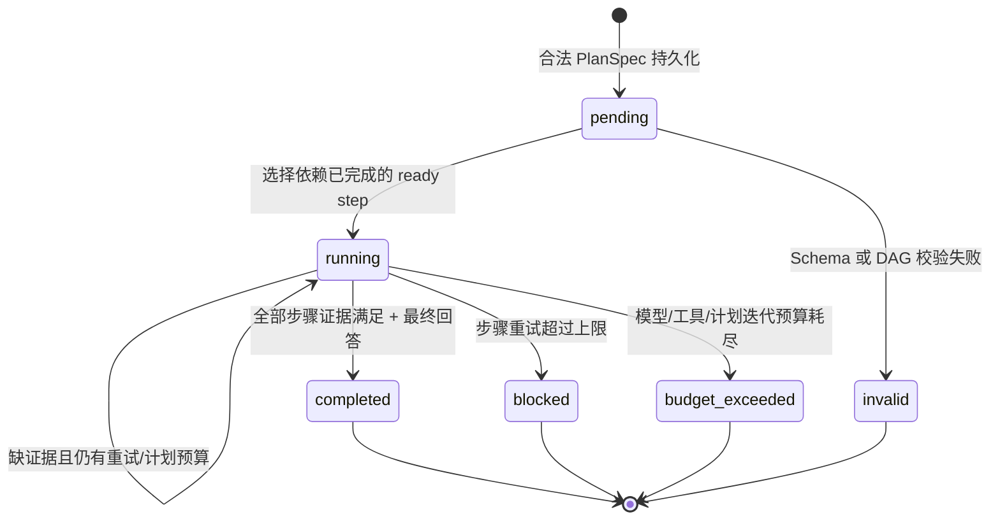
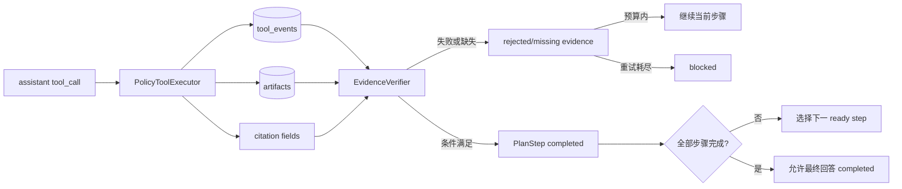
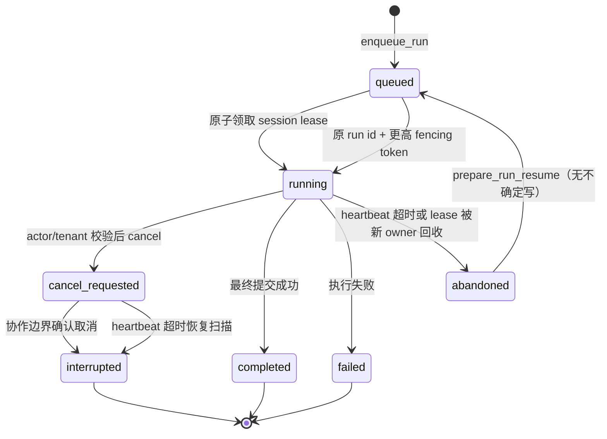
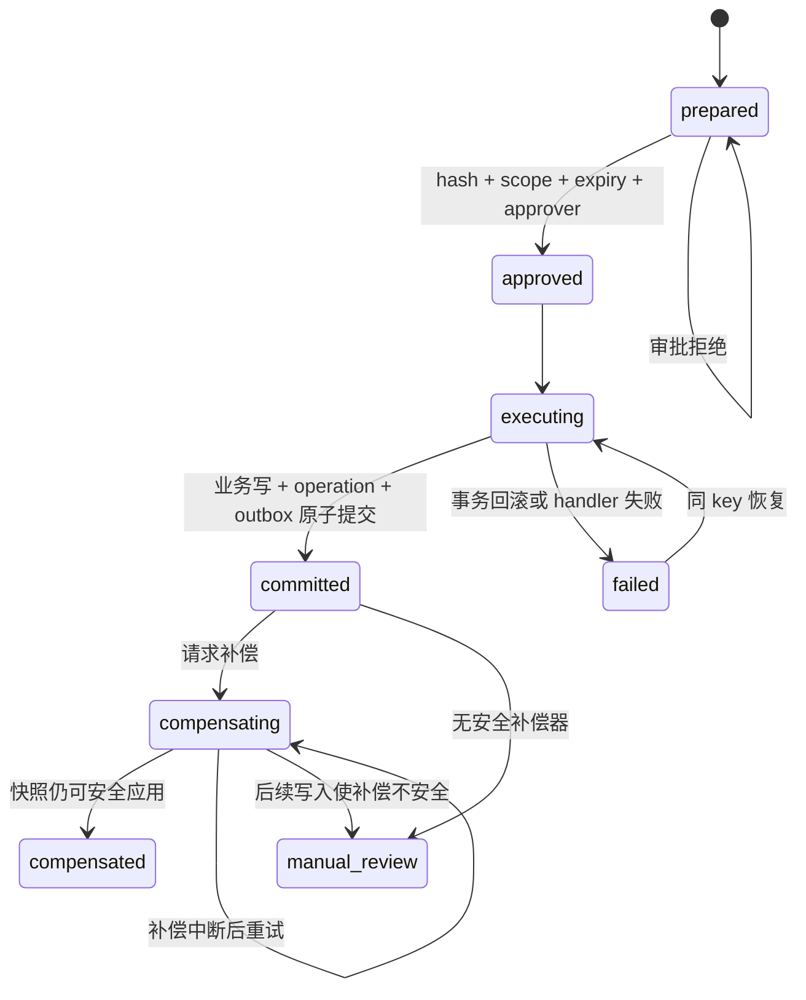

# EduAgent 可靠 Agent Runtime

本项目不再只展示“模型会调用 16 个工具”，而是提供一条可运行、可恢复、可治理的
Agent 执行链。设计目标是让模型调用、工具循环、上下文、状态、安全和扩展由明确的
运行时组件负责，而不是散落在 Prompt 或 Demo 脚本里。

## 一次请求的数据流

```text
调用方
  → EduAgentService.chat()
  → RuntimeManager（同 session 单飞、不同 session 并行）
  → RunContext（actor / tenant / role / course / budget）
  → StateStore 恢复短期会话
  → MemoryManager 召回长期记忆
  → KnowledgeProvider（可用且启用时暴露课程检索工具）
  → ContextEngine 原地压缩并创建可恢复 checkpoint
  → ContextManager 按预算构建 checkpoint + memory + 当前 user 快照
  → LangGraph Agent Loop
       → 复杂度门：复杂多步任务生成严格 PlanGraph；轻量任务跳过
       → PlanCoordinator：从 SQLite 恢复计划并选择 ready step
       → ResilientEngine：错误分类、退避、熔断、fallback、事件
       → PolicyToolExecutor：参数校验、角色、审批、写操作事务、脱敏、Artifact 溢写
       → ToolProvider：本地 registry / MCP / plugin
       → EvidenceVerifier：tool event / Artifact / citation → 步骤状态
       → Final Gate：全部步骤证据满足后才允许 completed
  → StateStore 持久化消息、run、tool event、audit event
```

主入口是 `edu_agent.service.EduAgentService`。旧 `run_agent()` 仍保留，作为低层编排接口和
已有评测兼容层；真实应用优先使用 Service，让身份、记忆、状态和安全策略不会被绕开。

## PlanGraph 与完成验证

Hermes 的 `todo` 解决长任务中模型忘记待办和压缩后失焦，但线性清单的 completed 仍由模型声明；
其 verification ledger/stop guard 解决“修改代码后没有新鲜命令证据却直接结束”。EduAgent 不复制
通用个人助理表面，而是把两个失败场景收窄为教学工具执行契约：计划是有依赖的 DAG，步骤完成
只能由确定性 `EvidenceVerifier` 判定。

只有真正复杂的多步任务进入计划路径；闲聊、越域问题、纯概念解释和简单单工具任务不增加
planner 调用。`ModelPlanGenerator` 返回严格 `PlanSpec`，Pydantic 拒绝坏 JSON、额外字段和重复
id；图校验拒绝未知依赖/工具、循环、无根、不可达和超过 `max_steps` 的计划。非法计划以
`invalid` 持久化并返回可恢复错误，不执行其步骤。



同一时刻执行器只向模型暴露当前 ready step 允许的工具，但这不是权限边界；
`PolicyToolExecutor` 仍按当前 `role/course_ids` 和审批策略复验，计划不能扩权。步骤范围通过图状态
和工具 schema 投影给模型，不插入 synthetic user 消息，也不重建会话 system prompt。



证据关联 `run_id/session_id/actor_id/tenant_id`；计划恢复要求四者全部匹配，步骤使用进入时的
tool event 游标，不会把历史或其他并发 session 的结果误算为当前证据。模型自述永远不是 accepted
证据。工具失败、审批拒绝、坏参数和 malformed event 形成 rejected evidence；Artifact 除了当前
owner/run/session 绑定，还必须通过路径、大小和 SHA-256 完整性校验。最终回答前运行时会重新检查
所有完成条件，不能仅凭持久化的 completed 标记放行。所有 planner 调用、验证后的模型续跑和工具
调用进入现有预算，另有 `planning.max_iterations` 防止无限循环。

## 教学 RAG 与引用门禁

`build_synthetic_corpus(seed=42)` 生成不含真实学生数据的固定课件库，文档和 chunk 均绑定 tenant、
course、标题、版本、chapter、section 与稳定 citation id。`SQLiteKnowledgeProvider` 是窄接口，默认
使用 SQLite FTS5/BM25；`KnowledgeToolProvider` 只有在 `[knowledge].enabled=true` 且数据库存在时
才附加 `retrieve_course_materials`，因此未部署知识库时仍保持原 16 个工具。

检索先在 SQL 内按 tenant/course/document active 过滤；可选语义 Provider 的返回还会逐 citation
解析并再次过滤，伪造 id、跨租户和跨课程结果不会进入 fusion。hybrid 使用确定性 RRF、去重和稳定
tie-break；`hybrid_rerank` 当前只有确定性词项重叠重排。未配置或调用失败的语义 Provider 会记录
`knowledge.semantic/retrieval_fallback` 并退回 sparse，不能把该档结果标成真实语义评测。

每个 chunk 返回 title/version/section/knowledge point/score/retrieval method/citation id，并标记
`untrusted_document=true`。课件内容只作为 tool result 数据，不能改变 system prompt、工具面或角色
权限。Evidence Verifier 在步骤完成和最终回答两个时点复验 citation 存在、当前作用域、引用是否出现
在答案，并通过 Provider 的确定性词项关系检查同句主张。文档停用后不再参与新检索，但旧 citation
仍可按原版本解析，不会静默指向新文本。

固定五问 benchmark 的真实离线 sparse 结果为 Recall@3/MRR@3/nDCG@3=`1.0`、citation precision
`0.416667`、coverage=`1.0`、ACL leak rate=`0.0`。semantic、hybrid、hybrid+rerank 未配置真实语义
后端，因此明确标记为未启用/未验证。

## 长短期记忆

- **短期记忆**：`sessions + messages` 保存完整会话；同一个 `session_id` 的下一轮自动恢复。
- **长期记忆**：`memories + FTS5` 保存稳定事实和偏好；按 `actor_id + tenant_id + scope`
  隔离，按当前问题召回。
- **冻结快照**：每轮开始只召回一次长期记忆，并注入当前 user turn；执行中不重建 system
  prompt，避免历史语义和缓存前缀漂移。
- **显式写入**：长期记忆通过 `EduAgentService.remember()` 或确定性候选经批准后写入，不把检索
  内容和模型任意结论自动当成事实。
- **治理字段**：记录 source、importance、expires_at、conflict_key；过期/停用项不召回，同一冲突键
  的当前输入停用旧值并写 `memory.conflict` 审计，更新和停用都复验 actor/tenant owner。

## 上下文管理

`ContextManager` 通过 `ContextBreakdown` 分列 system、冻结工具 schema、普通历史、当前 user、
Plan/Evidence、tool result、memory/checkpoint、协议开销和最大输出预留。请求前优先使用已注册 tokenizer，
否则使用版本化保守 estimator；assistant `tool_calls` 与对应的全部 `tool result` 始终作为原子组处理，
构建后还会执行配对不变量校验。

稳定 system prompt 和当前真实 user turn 是不可裁剪区；如果两者本身已超过预算，运行时抛出
`ContextBudgetExceeded`，要求调用方缩短或拆分输入，而不是继续向 Provider 发送必然溢出的请求。

`ContextEngine` 是可替换接口，内置 `CheckpointContextEngine` 在历史达到配置阈值后：

1. 先把超过结果预算的旧 tool result 写入现有 scoped Artifact；消息只保留 typed reference、SHA-256、
   脱敏 preview、classification、原长度和业务回执，写入失败的原子组不参与本次压缩。若没有可归档的完整旧
   exchange，但这次替换本身已回收上下文，则返回 `artifact_only`，不伪造空 checkpoint；
2. 按 assistant tool call + 全部 tool result 原子组选择旧 exchange，并显式保留 system、当前 turn、近期消息、
   未完成 Plan、审批/operation receipt、citation、Artifact ref、用户约束和未配对工具组；
3. 仅将选中的原消息标为 `active=0` 并关联 checkpoint，不删除或重写原文；精确 sequence 清单即使不连续也可恢复；
4. checkpoint schema v2 保存首尾 sequence、逐消息与整体 source hash、策略/estimator 版本、summary hash、
   压缩前后 Token、保留项、Artifact/citation/operation 引用、创建 run 和父 checkpoint；
5. 每次注入或恢复前复验 session/actor/tenant、创建 run、source/summary/parent hash、软归档状态以及 Artifact/
   operation 引用。缺失、篡改或 scope 不符会返回 `CONTEXT_CHECKPOINT_*` 并写 denied audit，不会继续生成答案；
6. checkpoint 与长期记忆一起放入当前真实 user turn，system prompt 保持逐字节稳定。原消息可通过
   `restore_context_checkpoint_messages()` 恢复，Artifact 引用也可在完整性复验后解引用；
7. trigger/release 双阈值、正值最小回收量和按新 user turn 计数的冷却窗口阻止逐轮 micro-compaction。策略 marker
   记录压缩时观察到的最大 sequence；达到 release 后重新武装，但进程重启不会把 retained recent 消息算成新内容；
8. 确定性摘要将 scope、用户约束、实体、approval、未完成 Plan、operation/citation/Artifact 引用放入结构化必保区。
   多代 checkpoint 解析并合并这些字段，不递归截断旧摘要；必保区超过上限时返回 `mandatory_summary_too_large`。

`013_context_checkpoint_provenance` 将旧范围型 checkpoint 幂等迁移为可兼容读取的 schema v1，并回填可取得的
scope、sequence 和 hash；新 checkpoint 使用严格 schema v2。R4.3 不增加数据库 migration，策略版本升级为
`artifact-first-hysteresis@2026-08-24.r4.3.v1`，仍使用 R4.1 前的确定性压缩 estimator。默认离线摘要和 overflow
恢复不依赖外部模型；Artifact-only 的持久边界由 Artifact metadata、source sequence、run/session/actor/tenant scope
共同复验，崩溃后不会再次外置同一结果。

## 持久运行预算

`RunBudgetLedger` 是父 run 与全部 descendant 的唯一预算真相。root identity 固定为
`root_run_id + session_id + actor_id + tenant_id`；恢复时任一 scope 不一致、limits 改变、pricing version 改变或
同版本具体价目漂移都会拒绝。预算维度和单位如下：

| 配置/快照维度 | 单位 | 包含内容 |
|---|---:|---|
| model calls | 整数 attempt | 父/child Agent、模型 planner/摘要、retry 与 fallback 的每个真实 Provider attempt |
| tool calls | 整数 call | 每个取得额度并进入 executor 的调用；串行与并发口径相同 |
| input/output/total tokens | Provider token | 所有 Provider attempt 分项累计，total 作为独立上限 |
| cost | micro-USD 持久、USD 展示 | 仅显式冻结价目可计算；未知价格不当作 0 |
| wall time | root elapsed ms | 从 ledger 创建到唯一 budget finalizer，包含退避、等待、压缩、工具和 child |

工具 batch 的规划、Manifest/参数预检、route 选择、context recount、journal/Trace 和 finalizer bookkeeping 不单独
增加 call/token/cost；它们仍计入 root wall time。确定性 checkpoint 压缩写稳定零额度 operation；模型压缩若启用
则必须作为 Provider attempt 计费。对外 response 仍只携带胜出结果的 usage，防止改变 API 语义；总账会结算失败
retry、fallback 和胜出 attempt 的全部用量。

所有并发入口先用稳定 operation/attempt id 调用原子 `reserve`。SQLite `BEGIN IMMEDIATE` 在 used + reserved 上
检查 model/tool/input/output/total/cost/wall-time，因而并发工具与同时启动的 child 不能超卖。child 批量启动前先
预留各自完整本地上限，再从 reservation 向 child operation 转移；child 的 `IterationBudget` 继续执行更严格的
model/tool/token/cost 限制。完成时按实际用量 commit 并释放差额；失败、超时、取消、拒绝或 worker lease 过期时
release。实际 Provider/child 用量高于预留时仍先完整落账，然后以固定优先级产生
`budget_exhausted:<dimension>`，不能丢弃已发生用量。

operation 保存请求指纹；相同 id 的等价 reserve/commit/release 重放幂等，内容冲突会失败。进程重开通过 ledger
加载冻结 identity、limits、used、reserved、stop reason 和价目，不刷新 allowance。`TurnFinalizer` 只使用
`budget-finalizer:<root_run_id>` 结算一次：原子释放尚未使用的 reservation、冻结 root wall time并保存快照；重复
调用返回同一结果，其他 finalizer id 被拒绝。R4.5 的进程 drain 使用这一唯一 finalizer，不另建终态路径。

Provider 返回 usage 时按 actual 结算；缺失时使用 R4.1 request breakdown 估算并标记 `estimated`，只有 total 时
保留实际 total，input/output 使用估算；流在 error 前已经产生的 usage 也不会丢失。`[pricing]` 必须给出版本和
route/model 的 input/output 每百万 token USD 价格，root 同时冻结版本和规范化价目。没有匹配价格时 snapshot 为
`cost_status=unknown`、`cost_usd=null`，同时
保留可计算的 `known_cost_usd`；不要把 unknown 配置成 0 来冒充免费。预算 Trace 只记录 operation id、聚合用量、
estimated/cost status、stop reason 与受限 route 元数据，不写 prompt、messages 或 tool arguments。

## 全局运行管理

`LifecycleController` 管理的是进程状态，不复用 run/session 状态机。Service 初始化期间保持 `starting`；StateStore
migration、SQLite 真实 INSERT 后 rollback 的写探测，以及启用的本地 Code Execution/MCP Provider 健康均成功后，
才单调转换到 `running`。外部模型短暂不可用不改变 readiness，由现有 breaker/retry/fallback 处理；这一策略避免
外部依赖抖动同时摘除所有副本。`/health/live` 与 `/health/ready` 无需认证，但只暴露 lifecycle、检查布尔值和活动
工作数量，不输出 endpoint、key 或异常原文。

API chat/resume/schedule 与 Scheduler claim 在接收边界原子取得 admission ticket。draining 与 admission 使用同一锁：
先取得 ticket 的工作继续运行，后到工作返回 503 或不领取任务。`SIGTERM`/显式 shutdown 进入 draining 后 readiness
立即失败，liveness 在进程仍执行收尾时保持成功；配置节 `[lifecycle]` 给出总 deadline、取消 grace、final flush 和
轮询间隔。

在 graceful 窗口内，已有 Provider stream、工具、TurnFinalizer、Scheduler runner 和 heartbeat 正常完成。到期后
广播 cooperative cancellation，并关闭可关闭的 MCP/工具 transport；再次等待有界 grace。仍未完成的本 owner run
在同一 SQLite 事务中标成可恢复 `abandoned`，不删除 session lease；不确定写进入 `manual_review`，已有 finalizer
cursor 进入 `resume_finalizer`，其他稳定 cursor 进入 `resume_from_persistent_plan`。之后执行有界 WAL checkpoint 和
资源 close。旧 worker 返回后仍必须通过 run status/lease/fencing；Scheduler completion 还必须匹配未过期 lease、
attempt_count 和 execution_key。重复 shutdown/signal 返回同一报告，不重复执行状态转换。

`RuntimeManager` 先用进程内锁提供低成本单飞，再用 `session_leases` 作为跨进程的持久 owner 真相。
领取在 SQLite `BEGIN IMMEDIATE` 事务内完成；同一 session 只有一个未过期 owner，不同 session
可以并行。owner id 由 hostname 和随机实例 UUID 组成，不依赖 PID。每次 lease 转移都会生成更高的
fencing token，heartbeat 在 run 活跃时续期，释放只接受当前 owner/run/token 三者完全匹配。
`RuntimeManager` 退出 scope 时还会读取 durable terminal；`TurnFinalizer` 未到 `terminal` cursor 时不释放
session lease，而是让其到期后由恢复 worker 以更高 token 接管。API request completion 同样在状态库事务内
复验 run/finalizer terminal，因此外层异常路径不能提前固化响应。



模型 HTTP 请求和普通 Python 工具线程不做危险的强杀。Agent loop 在模型调用前后、每个工具调用
之间、审批等待前后和 Plan step 边界执行协作检查；不可中断调用返回后还会重新校验取消状态、owner
和 token，过期结果直接丢弃。消息、压缩 checkpoint、Artifact、Plan step/Evidence、tool event 和
ToolOperation 写入都在提交路径验证 fencing。业务数据库中的写工具事务还会在提交期间持有状态库
fencing guard，避免“检查后 lease 转移、随后旧 worker 仍提交业务写”的跨库 TOCTOU 窗口。

`EduAgentService` 启动时扫描 heartbeat 超时的 `running/cancel_requested` run。安全恢复保留原 run id、
Plan、Artifact 和幂等 ToolOperation；已 committed 写入只返回原结果，不重复副作用。崩溃时仍为
`executing` 的不确定写转入 `manual_review`，不会自动重放。扫描后由 `RunRecoveryPlanner` 联合 journal、
tool call/result、operation 和 finalizer 真相产生脱敏决策并写入 Trace；resume 只执行该稳定 cursor 的动作。

| 崩溃/中断点 | 持久结果 | 恢复建议 | 自动行为 |
|---|---|---|---|
| queued，尚未领取 | `queued` | `retry_after_session_lease` | 等待或重新领取 |
| running，无不确定写，heartbeat 超时 | `abandoned` | `resume_from_persistent_plan` | 运维调用 `prepare_run_resume` 后以原 run id 续跑 |
| running，存在 `executing` 写 | `abandoned` + operation `manual_review` | `manual_review` | 禁止自动恢复，由人工确认外部副作用 |
| cancel_requested，worker 仍响应 | `interrupted` | `none` | 在最近协作边界停止且不提交返回结果 |
| cancel_requested，worker 已失联 | `interrupted` | `resume_from_persistent_plan` | 保留现场，不自动重放 |
| committed 写后进程崩溃 | operation 仍为 `committed` | `resume_from_persistent_plan` | 同幂等键返回原结果 |
| envelope 后、只读 result 前崩溃 | pending 只读 call，无 result | `replay-read` | 只读 handler 可重放，result 仍按 call id 唯一配对 |
| envelope 后、写 operation 为 `prepared/approved/failed` | 同一幂等 operation 未越过不确定边界 | `continue` | 沿既有事务合同恢复同一 operation |
| envelope 后、写 operation 为 `committed` | 持久 operation 回执 | `reuse-operation` | 不调用 handler，只配对原回执 |
| envelope 后、写 operation 状态不确定/未知 | `executing/compensating/compensated/manual_review` 或未知 | `manual-review` | 禁止自动恢复，由人工对账 |
| finalizer 子步骤后崩溃 | run 保持非终态 + 持久 cursor | `resume_finalizer` | lease 到期后从 cursor 继续，已完成步骤不重做 |
| terminal 后、API response 前崩溃 | terminal finalizer + 唯一最终消息 | `terminal_replay` | 重建同形状 `ChatResult` 后提交 request response |
| lease 过期且旧 worker 恢复 | 旧 run `abandoned` | `resume_from_persistent_plan` 或 `manual_review` | 新 owner 获得更高 token，旧 token 所有提交被拒绝 |

run/session 查询要求 actor 与 tenant 同时匹配。`get_run_status()` 返回状态、owner、最后 heartbeat、
取消标志、lease 剩余时间和恢复建议；`get_session_status()` 返回 active run、当前 owner/token 及同类
控制信息。常用只读运维检查可直接针对状态库执行：

```bash
# 当前租约、剩余秒数和 active run（将路径替换为实际 state_path）
sqlite3 ~/.edu-agent/state.db "SELECT session_id, lease_owner, fencing_token, active_run_id, heartbeat_at, expires_at, MAX(0, CAST((julianday(expires_at)-julianday('now'))*86400 AS INTEGER)) AS remaining_seconds FROM session_leases ORDER BY heartbeat_at;"

# 非终态 run 及恢复提示
sqlite3 ~/.edu-agent/state.db "SELECT id, session_id, status, owner_id, heartbeat_at, recovery_reason, recovery_recommendation FROM runs WHERE status IN ('queued','running','cancel_requested','abandoned') ORDER BY queued_at;"

# 必须人工确认的不确定写
sqlite3 ~/.edu-agent/state.db "SELECT operation_id, run_id, tool_name, status, updated_at FROM tool_operation_refs WHERE status='manual_review' ORDER BY updated_at;"
```

配置位于 `[runtime]`：`session_lease_seconds=30`、`session_heartbeat_seconds=10`、
`run_stall_seconds=90`；heartbeat 必须短于 lease，stall 必须长于 lease，不新增非凭据环境变量。
该机制只保证共享**同一个 SQLite 文件**的本机多进程/Worker 协调；进程内锁仍只是第一层优化。
它不提供跨数据库、跨主机文件系统、跨区域共识或网络分区下的分布式锁保证。

## 安全工具循环

每个工具由 `ToolSpec` 描述：

- JSON Schema 和 Handler
- category 和 risk level
- 是否写入，或哪些参数会触发写入
- 允许角色

工具安全分两层：

1. 模型请求前按角色与运行能力裁剪工具表面；学生看不到成绩明细、批量判分等教师工具，
   未配置隔离执行时看不到 `run_code`。
2. 执行前再次进行 Schema、角色、能力和审批检查；不能依赖“模型应该不会调用”。

`create_exam`、`assign_homework`、`batch_grade` 等写操作默认需要审批。`run_code` 默认关闭；启用时
只能通过健康、能力完整且真实 E2E attested 的 Jobe/Docker Provider，不能回退到 `python -I` 或
本地主机子进程。固定镜像、禁网、资源限制、取消、Artifact 与平台信任边界见
[`code-execution.md`](code-execution.md)。

### 写操作事务状态机

写工具由 `TransactionalToolRuntime` 透明包裹，只读工具不承担这部分事务开销。调用方优先传业务
idempotency key；否则使用 tenant/actor/session/run/plan step/tool call/tool/规范化参数生成。
Scheduler 为同一次调度发生实例持久化 `execution_key`，因此失败重试跨新 run 仍复用同一写入键。
相同 key 的 payload hash 或工具名变化会返回 `IDEMPOTENCY_CONFLICT`。



`tool_operations/tool_approvals/tool_outbox/tool_consumer_events` 与教学业务表位于同一个 SQLite
数据库。这样业务写入、`committed` 和 outbox event 才能共享真实原子边界；`StateStore` 只保存
`tool_operation_refs` 和带 `tool_call_id/operation_id/status` 的审计关联，不伪装成跨库事务。
已 committed 的重复调用直接返回原始结构化结果，不再执行 handler；Artifact 读取仍单独校验 owner。

Outbox worker 通过租约和 heartbeat 领取事件。发布成功但 ack 前崩溃会产生重复投递，这是明确的
“至少一次投递”，不是 exactly-once；消费者必须在自己的业务事务内用 `(consumer_name,event_id)`
去重。写操作的 Plan Evidence 只有在关联 operation 当前仍为 `committed` 时才接受，补偿后既有证据
会转为 rejected。

| 写工具 | 推荐业务键 | 补偿动作 | `manual_review` 边界 |
|---|---|---|---|
| `create_exam` | 学期/课程/班级/考试业务编号 | 无试题、作答、成绩依赖时删除新考试 | 已有关联试题、作答或成绩 |
| `assign_homework` | 课程/班级集合/作业发布批次 | 删除新作业及班级关联 | 外部通知/LMS 已发布需由外部适配器处理 |
| `batch_grade` | 考试/评分规则版本 | 当前值仍等于提交后快照时恢复逐记录旧值 | 成绩提交后又被人工或其他规则修改 |
| `generate_questions(save_to_bank)` | 课程/题库/生成批次 | 未被考试、作答、错题引用时删除新题及关联 | 任一生成题已被业务记录引用 |

`approval_ttl_seconds` 和 `outbox_lease_seconds` 位于 `[transaction]` 配置节。审批记录只保存脱敏参数、
payload hash、scope、有效期和 approver，不保存 token 或明文凭据。通用插件不能直接注册裸连接写工具，
需要先实现受控事务适配器。

所有工具结果统一为：

```json
{"ok": true, "data": {}, "error": null, "meta": {}}
```

坏 JSON、未知工具、参数错误、越权、审批拒绝、工具异常都会作为结构化 tool result 回灌，
模型可以修正参数，但不能绕过运行时策略。

大结果还会经过 `ToolResultBudget`：单结果和单轮总字符预算超限时，完整 JSON 在凭据脱敏后写入 Artifact，
模型只接收 `edu-agent.scoped-artifact.v1` 引用、脱敏 preview、classification、Artifact id、原长度和 SHA-256，
不会接收服务端绝对路径。Artifact 按 tenant/actor/session 分目录，读取必须匹配 owner/session 并通过路径与 hash
校验；普通工具执行写盘失败会安全降级为内联预览，压缩前写盘失败则保留该完整工具原子组。

## 状态与可观测性

`StateStore` 使用 SQLite WAL、`busy_timeout` 和显式写事务，保存：

- sessions / messages
- runs（状态、owner/token、heartbeat、取消、恢复原因/建议和持久 stream sequence 高水位）
- run_journals（phase、loop cursor、model attempt、event sequence、冻结 route/预算、稳定边界和真相表引用）
- turn_finalizers / turn_finalizer_hooks（收尾 cursor、唯一最终消息、usage/budget、终态和后处理 claim）
- run_budget_ledgers / run_budget_operations（root 全树 limits、used/reserved、稳定 operation 与唯一 finalizer）
- session_leases（当前 owner、单调 fencing token、active run、heartbeat 和 expiry）
- tool_events（tool call / operation 关联、参数、结果、耗时）
- tool_operation_refs（operation owner、调用关联和当前状态）
- context_checkpoints（source sequence/hash、策略/estimator、summary hash、压缩前后 Token、保留项、引用和创建 run）
- artifacts（owner、路径、大小、SHA-256）
- provider_events（重试、熔断、fallback、恢复）
- plans / plan_steps / evidence（DAG、步骤游标/重试、真实证据绑定）
- memories / memory_fts
- audit_events（审批与安全决策）
- scheduled_jobs（租约和最近执行结果）

这些表使一次失败可以回答“哪个用户、哪次 run、哪个工具、什么参数、为什么被拒绝或失败”，
而不是只剩终端日志。

R2.1 另定义了进程内 `RunEvent v2` 传输 envelope 和 `RunEventBus`。事件按 `(run_id, attempt)` 在线程安全的
临界区分配单调 sequence，并用 `writer_id + fencing_token` 拒绝旧 writer；`completed/error` 后关闭 stream。
订阅是 future-only 有界 buffer，stream state 和活跃订阅数也有 fail-closed 总上限；溢出只隔离慢消费者，
主动取消只取消订阅，不取消 run。所有 payload 在发布前经过共享 `RedactionPolicy`，但 EventBus 不写
SQLite、不保留历史，也不提供恢复游标。

持久边界保持不变：`TraceRepository` 继续只从上述业务/审计表投影 `RuntimeEvent v1`，EventBus 不是第二套
Trace 真相；恢复 sequence/loop cursor 由 `RunJournal` 承担。R2.3 已把 assistant tool-call envelope 和逐个
tool result 接入 Agent Loop：消息、call 配对和 journal cursor 在同一 SQLite 事务提交，旧 fence、孤立 result、
重复 call id 与跨 run 配对会被拒绝。R3 以后，只有连续、无冲突且显式 `effect=read + parallel_safe` 的调用可在
有界 worker 中并发候选执行；所有 tool result/journal cursor 仍按原 call 顺序提交。R2.4 的 `011_turn_finalizer` 将 SQLite schema
version 提升到 11，并由唯一 `TurnFinalizer` 按固定 cursor 完成未配对 call 关闭、Plan/Evidence 复验、唯一
最终 assistant、usage/budget、terminal、后处理和有界 cleanup。失败路径会合并已选 Provider 事件与异常携带的
usage；terminal 后恢复继续未完成的 hooks/cleanup，再重建兼容 `ChatResult`。R2.5 已让 Chat Completions 与
Responses adapter 产生带 route/attempt/provider event id 的真实 text/tool/usage/completed/error 流；同步
`chat()` 聚合同一流为兼容 `EngineResponse`。首个可见 delta 前的瞬态错误可按既有策略 retry/fallback，之后的
失败直接结束该 Provider 流且不拼接新输出。R2.6 的 HTTP SSE 通过绑定 attempt 与 session lease fence 的单个
`RunStreamWriter` 输出 accepted、text/tool/plan/usage 和 completed/error，handler 是唯一 socket writer；
keepalive 只在事件空闲时保活。有界订阅队列隔离慢消费者，断流、显式 cancel 与 deadline 取消同一个
`CancellationToken`，并传播到 Provider、Agent、工具、子 Agent 和代码执行。同步 SDK 若不能强杀，返回后仍由
token/fence 拒绝迟到提交；EventBus 不承担跨进程 payload replay。
R2.7 的 `012_r2_recovery` 将 schema version 提升到 12，增加 `runs.stream_event_sequence`；可见事件先持久
预留 sequence 并复验当前 lease/fence。`RunRecoveryPlanner` 从稳定 cursor 选择
`continue/replay-read/reuse-operation/manual-review/terminal-replay`，resume 前复验冻结 manifest/route 并恢复
预算 snapshot。五个 fault fixture 都关闭崩溃 Service、推进 lease 时钟，再以同一 SQLite 文件构造新 Service；
EventBus 仍不保存历史 delta，工具并发不改变原序消息和恢复游标。
R4.2 的 `013_context_checkpoint_provenance` 将 schema version 提升到 13，新增 checkpoint provenance、引用和父链字段；
迁移可重复执行，旧 checkpoint 保持 schema v1 兼容读取，新写入使用严格 schema v2。
R4.4 的 `014_run_budget_ledger` 将 schema version 提升到 14；同一迁移可重复运行，root identity、价格、已用和
预留额度在恢复时保持不变。
R4.6 的 `015_storage_maintenance` 将 schema version 提升到 15，增加精确 retention hold 与 Artifact
`gc_pending_at` 两阶段续收标记。在线 backup/restore、引用校验、删除资格和运维命令见
[SQLite 状态备份、恢复与 Retention/GC](storage-operations.md)。
R5.4 的 `016_run_replay_scope` 将 schema version 提升到 16，把 run 创建时的 replay scope 持久化到
`runs.replay_scope`；恢复时从该列重建幂等域，避免 operation commit 后重开进程派生新 key。旧库迁移幂等，
新库和恢复路径使用同一字段，不存在 demo 专用旁路。

`StateStore` 的 WAL、lease、fencing 和 GC 只适用于能共享同一个 SQLite 文件的本机 Worker；它们不提供
跨主机共识、网络分区一致性或共享文件系统锁语义。多主机部署必须替换状态协调层，不能沿用单机 SQLite 声明。

## 可插拔扩展

- 本地 registry、MCP provider 都实现 `ToolProvider` 契约，Agent 侧统一收到 `ToolResult`。
- 10 个教学 query 和 5 个教学 command 经 canonical `TeachingDataProvider`；写 command 只能从 `PolicyToolExecutor -> registry.dispatch_transactional` 路径进入。
- 当前实现是 `SyntheticProvider`；真实 `TeachingPlatformProvider` 和私有 API/ORM 映射仍属于 L1，未作为 R3 能力声明。
- `run_code` 仅经健康、capability 完整且已审批的 `CodeExecutionProvider`，不创建教学库连接或 ToolOperation。
- `PluginManager` 支持 Python entry point `edu_agent.plugins` 和显式模块加载。
- 插件只能通过 `PluginContext.register_tool()` 注册工具，并显式提供 source/version/schema hash/effect/capability；
  缺失、冲突或部分加载默认整体拒绝，不需要修改 Agent Loop。
- MCP discovery 同样校验本地 trusted catalog、annotations 和 schema identity；重名、名称抢占、catalog 漂移与
  断线迟到结果 fail closed。远端调用仍经过本地参数、ACL/course、取消/timeout 与结果预算。

插件包在 `pyproject.toml` 中声明：

```toml
[project.entry-points."edu_agent.plugins"]
school-calendar = "school_calendar_plugin"
```

模块提供 `register(context)`，并注册 Tool Schema、Handler、风险和角色元数据。

## 任务调度

`JobStore` 保存一次性/周期任务；`Scheduler.tick()` 通过 SQLite `BEGIN IMMEDIATE` 和租约
原子领取到期任务；领取前必须持有 lifecycle admission，runner 执行期间后台 heartbeat 自动续租并携带
attempt/execution fencing。状态机为：

```text
pending → running → success
                  → pending（周期任务）
                  → retry_wait → running → dead_letter
                  → cancelled
```

创建支持 actor/tenant 作用域内的 idempotency key；失败按指数退避重试；达到 `max_attempts`
进入 dead letter；只有 owner 可以请求取消。一次调度发生实例的 `execution_key` 在重试期间保持稳定，
成功进入下一周期后才清空；它与写工具事务键组合，避免 worker 在业务写入后、任务记成功前崩溃造成
重复副作用。

## 模型容错

`ResilientEngine` 把错误分为连接、超时、限流、服务端、认证、权限、非法请求、上下文溢出、输出上限和
未知错误。只有连接/超时/429/5xx 才在韧性层退避重试；认证、权限、参数、上下文和输出上限问题快速失败。本地退避
使用有上限的 full jitter；合法的 `Retry-After` 秒数或 HTTP-date 优先，并受独立配置上限约束。并发限制、
连续瞬态失败计数和 breaker 都按冻结的 route identity 隔离；冷却后的 half-open 同一路由只允许一个探测。
route 状态表由 Engine 实例拥有，具有容量和空闲 TTL，避免进程级状态无限增长。每次 Provider attempt 的
route、failure kind、delay、breaker 状态和数值 usage 都经过中心脱敏后关联 run_id 写入 `provider_events`。
默认 OpenAI SDK client 的内部重试关闭，避免未审计请求绕过该策略；显式注入 client/factory 时由调用方控制。
fallback 只接受上述明确瞬态 failure kind 或 circuit-open，并在 Provider I/O 前验证目标 API mode adapter、
tool calling、strict structured output、请求形态和上下文需求；未知 fallback context window 不视为无限。
401/403/普通 400/context overflow/output cap/unknown 均拒绝切换并保留 primary 原错。候选 route 在 turn 起点冻结，
`route_resolved/fallback_rejected/fallback_activated/provider_result_selected` 解释选择与唯一胜出结果；失败 attempt
usage 不能覆盖最终响应，但与胜出 attempt 一样进入 root ledger。每条 route 仍只有一个 `CredentialRef`，不实现
凭据轮换池。

Service 在 Provider 明确返回 input context overflow、且流尚未产生可见 delta 时拥有一个更窄的恢复分支：重新计数，
强制执行一次 checkpoint/Artifact-only 压缩，重建请求，并在相同冻结 route 上重试一次。checkpoint 或已复验的 Artifact
replacement 是持久恢复边界；recount、started/committed/retry_started/succeeded 或 exhausted 状态写入 journal/Trace。
output cap、普通 invalid request、本地当前输入过长、第二次 overflow 和已有可见 delta 的错误直接失败，不会进入循环
或借 fallback 隐藏原错；取消与 finalizer 竞争仍由 fencing 和唯一终态 cursor 收敛。

`EduAgentService.scheduler()` 用同一个 Service 执行任务，因此计划任务不会绕过记忆、预算、
工具安全和状态持久化。

## 验证

```bash
uv run --frozen ruff check edu_agent/agent/graph.py edu_agent/planning edu_agent/runtime edu_agent/service.py edu_agent/state/store.py tests/test_distributed_runtime.py tests/test_plan_runtime.py scripts/runtime_recovery_demo.py
uv run --frozen python -m pytest tests/test_distributed_runtime.py -q
uv run --frozen python -m pytest tests/test_plan_runtime.py -q
uv run --frozen python -m pytest tests/test_rag_runtime.py -q
uv run --frozen python -m pytest tests/test_transactional_tools.py -q
uv run --frozen python -m pytest tests/test_runtime.py tests/test_extensions_scheduler.py -q
uv run --frozen --offline python -m pytest tests/test_lifecycle.py tests/test_api_sse_cancellation.py tests/test_extensions_scheduler.py tests/test_r2_recovery.py tests/test_cancellation.py -q
uv run --frozen --offline python scripts/accept_r1_fake_provider.py
uv run --frozen python -m pytest tests -q
uv run --frozen python scripts/production_runtime_demo.py
uv run --frozen python scripts/plan_runtime_demo.py
uv run --frozen python scripts/rag_runtime_demo.py
uv run --frozen python scripts/eval_retrieval.py
uv run --frozen python scripts/transactional_tools_demo.py
uv run --frozen python scripts/runtime_recovery_demo.py
uv run --frozen --offline python scripts/r2_recovery_demo.py
zsh scripts/accept_r2.sh
uv run --frozen python scripts/code_sandbox_demo.py --provider docker --e2e --require-all
uv run --frozen python scripts/eval_plan_ablation.py --engine oracle
```

测试覆盖真实临时 SQLite，而不是把状态层全部 mock 掉；同时验证用户/租户隔离、工具消息
配对、审批拒绝、坏 JSON 修复、预算停止、插件注册、任务租约和模型重试分类。Plan 目标测试还
覆盖 DAG 校验、早停拦截、Artifact/citation、角色课程边界、进程恢复、并发 session 隔离、旧库
原地升级和确定性停止。分布式运行控制测试使用两个独立 `StateStore/Service` 和可注入时钟，覆盖
lease 争抢/续期/转移、旧 owner fencing、三类取消边界、恢复幂等、压缩并发与越权查询。oracle
消融只证明 harness/计划路径正确；没有真实端点时必须标注
“真模型数据未运行”。
